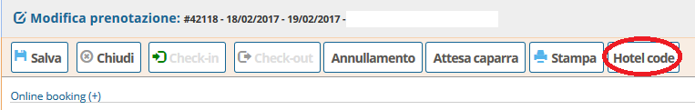
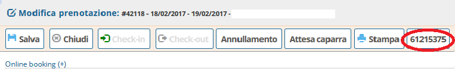
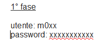
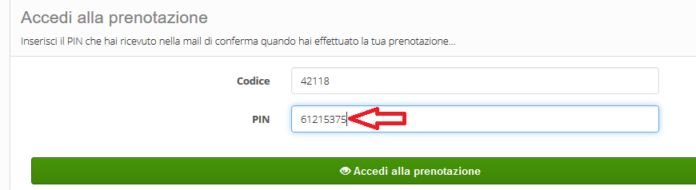
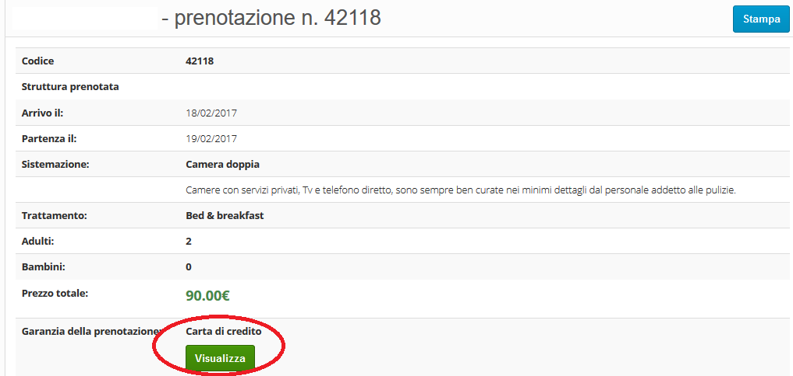

[Indice](index.md) / [Quovai PMS](quovai-pms-it.md) / Accedere ai dati della carta di credito 

# Come accedere ai dati della carta di credito del cliente

Per accedere ai dati della carta di credito del cliente, si clicca su Gestione e poi Prenotazioni.

Si trova una lista di prenotazioni e si clicca sulla prenotazione scelta (è possibile cercare la prenotazione con il box di ricerca inserendo il numero della prenotazione).

Si apre la scheda **Modifica prenotazione** e si preme sul bottone Hotel code che appare in alto nella lista delle azioni disponibili per la prenotazione

Cliccando sul bottone Hotel code, questo cambia aspetto e mostra un numero di 8 cifre. Una nuova pagina del browser si apre.

Le credenziali per accedere a questa nuova pagina sono le stesse per accedere **al livello 1 del gestionale:**

A questo punto appare un modulo per l'inserimento del PIN di 8 cifre (il numero della prenotazione è precompilato).

Cliccando sul bottone Accedi alla prenotazione si apre la scheda del cliente con il dettaglio della prenotazione.

**Nota bene:** cliccando sul bottone Visualizza, i dati della carta di credito del cliente diventono visibili.

Cliccando su Ricarica la pagina si ritorna alla scheda del cliente.
