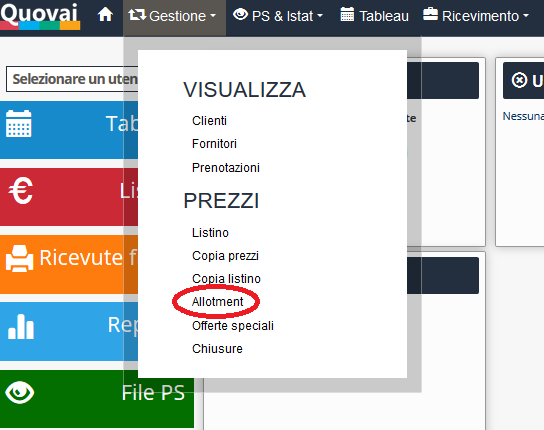
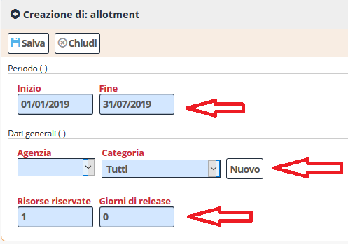
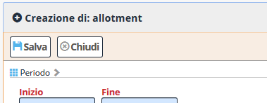

[Indice](index.md) / [Quovai PMS](quovai-pms-it.md) / Gestire l'allotment

# Gestire l'allotment

*Un contratto tra cliente business (Tour Operator, OTA o azienda) e struttura ricettiva. L’oggetto del contratto, negoziato ogni anno, sono una parte di camere (un contingente o un lotto, da qui la parola ‘allotment’) che la struttura mette a disposizione del cliente. Questi è depositario di quel numero di camere e potrà venderle ai suoi clienti entro un termine. Se non riesce a vendere le camere entro il termine stabilito nel contratto deve rilasciare questo lotto di camere invendute al gestore della struttura ricettiva, che ne rientra così in possesso per poterle vendere direttamente.*

Cliccate su **Gestione** e poi **Allotment**.

  

Poi sotto **Allotment** cliccate su **Nuovo**. 

I campi di riempire sono: il periodo desiderato dell'allotment (inizio e fine); agenzia; categoria di camera/appartamento/alloggio; risorse riservate per l'agenzia e poi i giorni di release.

  

Alla fine dell'operazione, premete su **salva**.

Definizione 
**Release** è un numero di giorni _n_ che determina l'arco temporale da oggi ad _n giorni_ in cui l'allotment decade.  