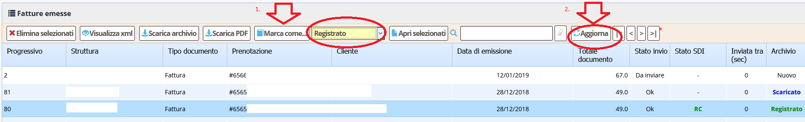

[Indice](index.html) / [Quovai PMS](quovai-pms-it.md) / Archiviare e registrare le fatture

## Archiviare e registrare le fatture

E' ora possibile assegnare uno stato di archiviazione alle fatture che vi consente di capire:

 - Quali fatture sono nuove
 - Quali fatture sono state scaricate in un archivio per l'invio allo Studio del Commercialista
 - Quali fatture sono state effettivamente inviate allo Studio o registrate nel programma fornitovi dallo Studio

### I tre stati delle fatture
E' possibile assegnare alle fatture 3 stati:

 - **Nuovo** (la fattura è appena stata creata o ricevuta)
 - **Scaricato** (la fattura è stata scaricata in un archivio .zip)
 - **Registrato** (la fattura è stata inviata al programma dello Studio)

L'assegnazione dello stato "**Nuovo**" avviene in automatico quando una fattura è stata creata o ricevuta.

Lo stato "**Scaricato**" viene assegnato quando scaricate un archivio .zip tramite la funzionalità di scaricamento archivio della lista documenti.

Può anche essere assegnata manualmente scegliendo lo stati "**Scaricato**" dalla tendina visibile nella lista documenti:

e cliccando su `Marca come...`.
Una volta ricaricata la pagina con `Aggiorna` sarà possibile vedere il nuovo stato.

Lo stato "**Registrato**" viene assegnato manualmente quando le fatture sono state effettivamente passate nel programma dello Studio o nel programma di interfaccia per passare le fatture elettroniche allo Studio.

Si sceglie lo stato "Registrato” dalla tendina visibile nella lista documenti:

e si clicca su `Marca come…`.  
Una volta ricaricata la pagina con `Aggiorna` sarà possibile vedere il nuovo stato.

