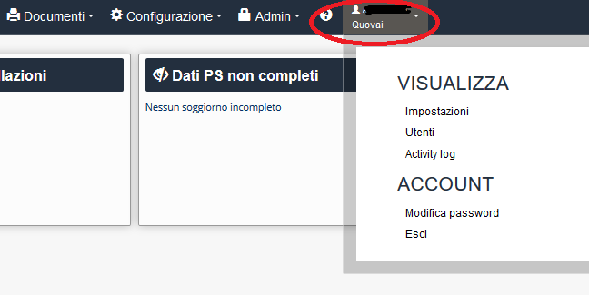

[Indice](index.html) / Modifica password/nuovi utenti/activity log

# Modifica password/nuovi utenti/activity log

Nell'area log in, potete trovare (se avete il **ruolo di amministratore**) e visualizzare la cronologia di navigazione (activity log) ed altre attività come modifica password, lista di utenti ecc. 

 
Sotto **utenti**, potete aggiungere nuovi utenti (**e configurare il password** che sarà cambiato dal nuovo utente in un secondo istante).

Per **activity log**, si intende la registrazione degli accessi logici (autenticazione informatica) al PMS da parte degli utenti. La raccolta dei log serve per verificare anomalie nella frequenza degli accessi e nelle loro modalità (orari, durata, oggetto, riferimento…). 

**Modifica password** è la voce per cambiare il password di accesso al PMS.
