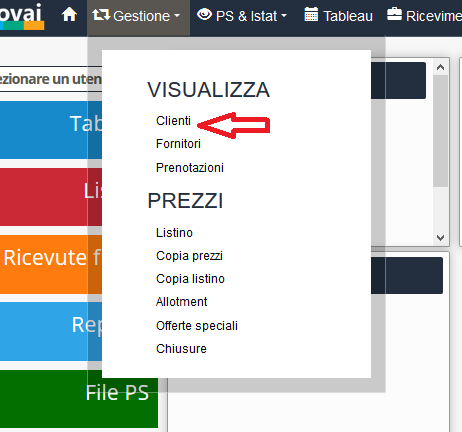
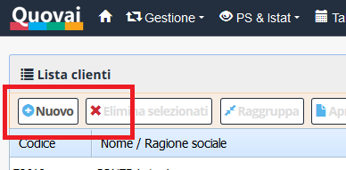
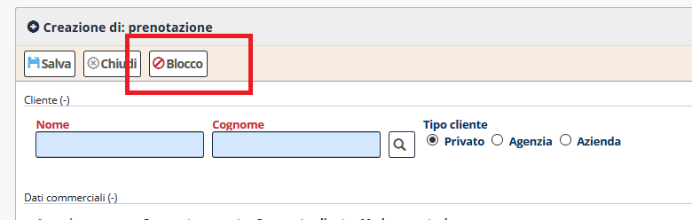
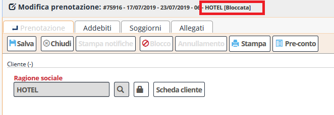
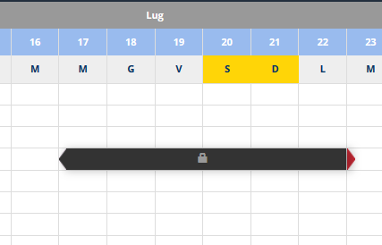

[Indice](index.md) / [Quovai PMS](quovai-pms-it.md) / Bloccare una camera/un appartamento rapidamente

# **Bloccare una camera/un appartamento rapidamente**

**Occorre (per la prima volta):**
- Andare in Gestione->Clienti

 

- Cliccare su Nuovo, poi evidenziare Azienda
 
 
  
- Sotto Ragione Sociale, inserire **HOTEL**
 
 
  
- Salvare

**Per le volte successive:**
- Aprire il Tableau per inserire la prenotazione "Creazione di una prenotazione".  

- Cliccare su **Blocco** e la camera/l'appartamento viene bloccata/o.

 
 
 
 
 

 

