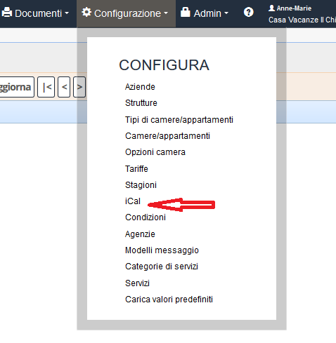
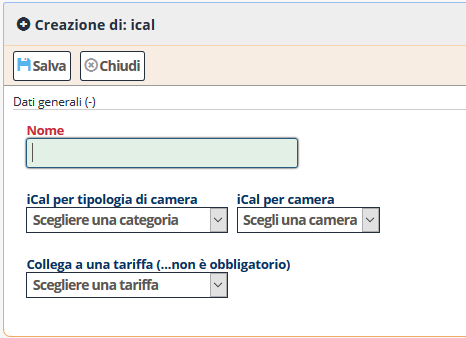
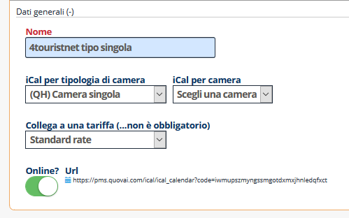

[Indice](index.md) / [Quovai PMS](quovai-pms-it.md) / Calendario iCal - come utilizzarlo

# **Calendario iCal - come utilizzarlo**

Nel caso in cui un portale online non offra un’interfaccia Channel Manager a 2 vie è possibile ricorrere all’iCal per **sincronizzare la vostra disponibilità.**

I portali più conosciuti che possono essere aggiornati tramite iCal sono **Homeaway, FlipKey, FeWo-direkt ed ultimamente Agriturismo.it ecc.** I nostri link iCal danno la disponibilità in tempo reale, i tempi di aggiornamento invece dipendono da ogni quanto il portale li scarica (per esempio agriturismo.it ogni due ore).

**Occorre:**  
  
1. Andare in Configurazione->Tariffe

2. Entrare in modifica della tariffa. 
 

  
3. Impostare "**iCal abilitato**" e salvare.

4. Cliccare sul link iCal (vedere immagine sotto) con il mouse destro e copiare l'indirizzo che potrete inserire nei portali che ve lo richiedono.

  
5. Inserire il link nel portale scelto. All'interno del portale è importante assegnare **un nome al calendario** in modo da poterlo riconoscere facilmente.
  
**Alcune guide per sincronizzare i calendari:**  
[https://aiuto.homeaway.it/articles/Come-sincronizzo-il-mio-calendario-di-HomeAway-con-un-altro-calendario](https://aiuto.homeaway.it/articles/Come-sincronizzo-il-mio-calendario-di-HomeAway-con-un-altro-calendario)  
[https://www.tripz.com/help/articles/getting-your-ical-link-from-tripadvisorflipkey/](https://www.tripz.com/help/articles/getting-your-ical-link-from-tripadvisorflipkey/)  
[https://hilfe.fewo-direkt.de/articles/Wie-synchronisiere-ich-meinen-FeWo-direkt-Kalender-mit-einem-anderen-Kalender](https://hilfe.fewo-direkt.de/articles/Wie-synchronisiere-ich-meinen-FeWo-direkt-Kalender-mit-einem-anderen-Kalender)  
[https://www.agriturismo.it/it/extra/come-sincronizzare-il-calendario-di-agriturismo-it-con-quello-di-altri-portali-1213](https://www.agriturismo.it/it/extra/come-sincronizzare-il-calendario-di-agriturismo-it-con-quello-di-altri-portali-1213)

VIDEO su **Come creare un iCal per inviare la disponibilità ai portali**  
[https://youtu.be/NxLciNKSyNE](https://youtu.be/NxLciNKSyNE)