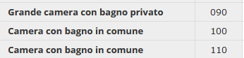
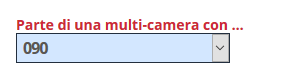
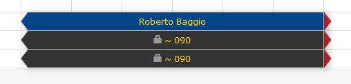

[Indice](index.md) / [Quovai PMS](quovai-pms-it.md) / Camere comunicanti

# **Camere comunicanti**

Vi capita di avere due camere che possono essere unite insieme e prenotate come un'unica camera? Oppure una villa costituita di vari appartamenti che possono essere uniti insieme e prenotati come l'intera casa? La gestione delle camere comunicanti (**multicamere**) fa al caso vostro.  

## Come funziona

Innanzitutto create la tipologia per la multicamera (quella che raccoglie sotto di sé più unità) e per i componenti (le singole unità).

 

Poi all'interno della scheda della singola unità (es. App. 100) dovete scrivere che fa riferimento a una multi-camera.

  
Infine, sul tableau, quando inserite una prenotazione in una delle camere componenti, si chiude la multicamera, mentre quando inserite una prenotazione sulla multicamera, si chiudono le camere componenti. Lo stesso vale per la cancellazione, che libera le componenti quando viene cancellata la multicamera, libera la multicamera quando vengono cancellate (o eliminate) tutte le componenti:

 
  
## Booking online e channel manager

Nel booking online Quovai, la multicamera tiene automaticamente conto della disponibilità dei componenti. Sui portali, invece, sarà bene decidere se mettere in vendita la multicamera o i componenti per evitare overbooking (potrebbero essere prenotate contemporaneamente...).
