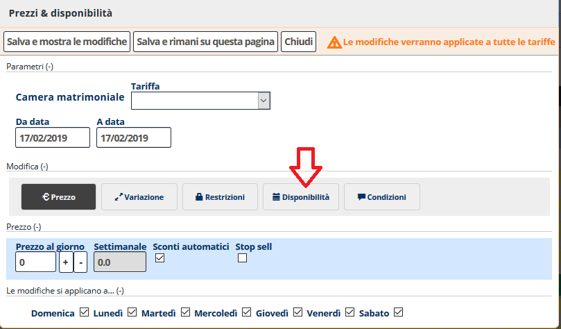

[Indice](index.md) / [Quovai PMS](quovai-pms-it.md) / Chiudere e aprire le camere

# Chiudere e aprire le camere

Clicca su **tableau**, evidenzia le date per cui vorresti chiudere le camere (dal giorno al giorno) con il mouse sinistro.  
Si apre un modulo

  