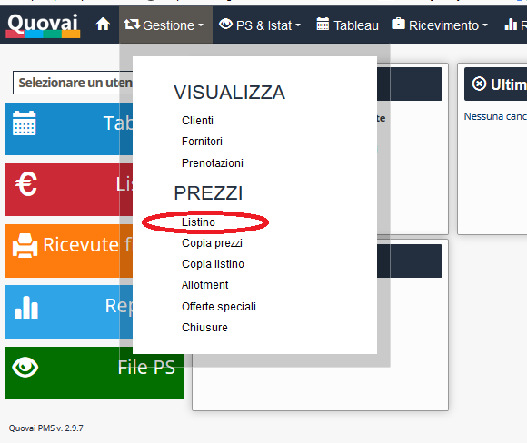

[Indice](index.md) / [Quovai PMS](quovai-pms-it.md) / Chiudere e aprire le camere

# Chiudere e aprire le camere (disponibilità)

Clicca su **Gestione** e poi **Listino**.

Premi **disponibilità**. 

Appare il modulo per cambiare la disponibilità del tuo inventario sul tuo booking engine (sito web) e sul channel manager per l'intervallo delle date scelte.

 

Alla fine dell'operazione, premi **Salva**. Il cambiamento viene mostrato sul listino. 