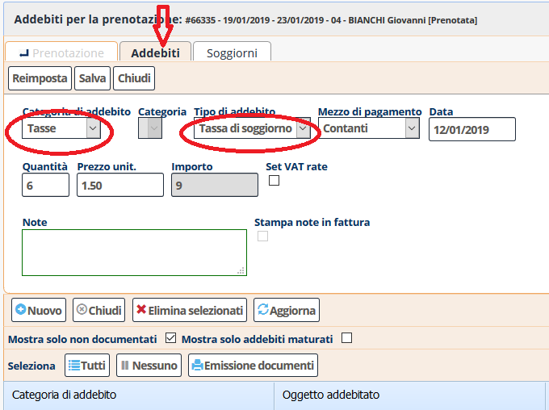

[Indice](index.html) / [Quovai PMS](quovai-pms-it.md) / Come aggiungere la tassa di soggiorno

# Come aggiungere la tassa di soggiorno

All'interno della scheda della prenotazione si va nella sezione "Addebiti", si seleziona "Nuovo" e si inserisce una nuova "Tasse" sotto "Categoria di addebito", scegliendo "Tassa di soggiorno" come tipologia di addebito:

Per un periodo dal 9 al 12 di gennaio (3 notti) per 2 adulti, il totale della tassa (1,5 euro/notte) viene calcolato automaticamente.

Con "Salva" l'addebito viene registrato.

N.B. Sotto **Configurazione / Struttura**, si può impostare le date di inizio tassa di soggiorno e fine tassa di soggiorno.  

