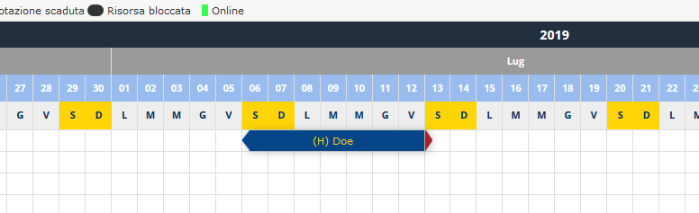
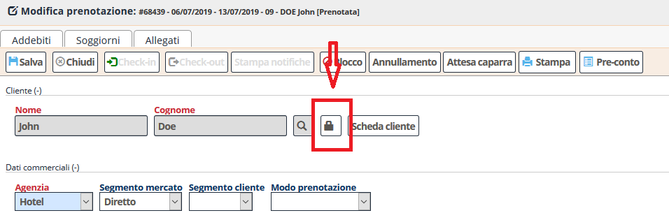

[Indice](index.md) / [Quovai PMS](quovai-pms-it.md) / Come cambiare un nome sulla scheda cliente

# Come cambiare un nome sulla scheda cliente

Dal tableau, clicca sulla prenotazione:

Si aprirà la scheda cliente. Clicca sul lucchetto. Inserisci il nuovo nome e salva.

