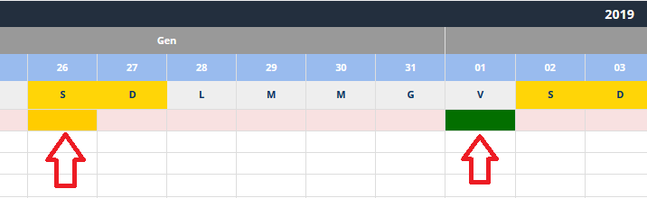
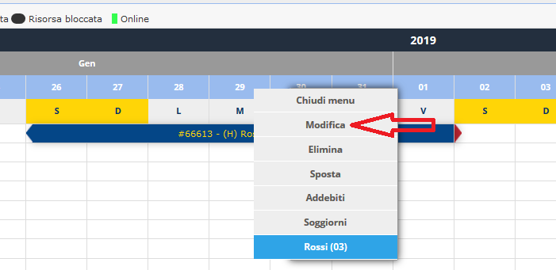

[Indice](index.html) / Come creare una prenotazione

# Come creare una prenotazione

Clicca su **Tableau**. Per creare una prenotazione, si clicca sul giorno del **primo pernottamento** (che diventa verde e poi arancione) e sul giorno di **ultimo pernottamento**.

Es. per creare una prenotazione da Sabato a Sabato, clicco sul **Sabato di arrivo** e quindi sul **Venerdì precedente alla partenza**.

Una volta indicate le date, i giorni corrispondenti alla prenotazione si colorano di giallo per qualche istante e appare un box con la scritta Caricamento in corso …

Appare il modulo per l'inserimento della prenotazione con le date selezionate:
nel nostro caso giorno di arrivo **Sabato 26/01**, giorno di fine soggiorno **Venerdì 01/02**, giorno di check-out **Sabato 02/02**

Nel modulo di prenotazione le date sono precompilate (con le date scelte cliccando sul tableau). Per salvare una nuova prenotazione è quindi sufficiente creare un cliente inserendo ora solo nome e cognome (gli unici dati obbligatori). 

E' **utile** anche compilare i Dati Commerciali (agenzia, segmento mercato, segmento cliente e modo prenotazione) per poter condurre una seria analisi del portafoglio clienti. Questi dati commerciali possono essere impostati come dati obbligatori in fase di prenotazione (vedi immagine).

**Nota bene:** se non conoscete il nome del cliente o il cognome, potete usare in questa fase dati fittizi come ad esempio Cliente Tedesco o Cliente di Milano. Potrete sempre modificare i dati del cliente in seguito.

Premeremo poi su **Salva**.

Alla prenotazione viene assegnato un codice (vedi immagine) e assume lo stato di **Prenotata**.

Cliccando ora su **Chiudi** si ritorna al tableau con la prenotazione che occupa le date scelte dall'utente. La lettera (H) davanti al cognome rappresenta l'agenzia HOTEL (già definita precedentemente sotto i dati commerciali).

In caso si volessero effettuare nuove modifiche alla prenotazione, si clicca sulla prenotazione dal tableau (con il tasto sinistro del mouse) e viene mostrato un menu che contiene tra le altre la voce **Modifica**.

