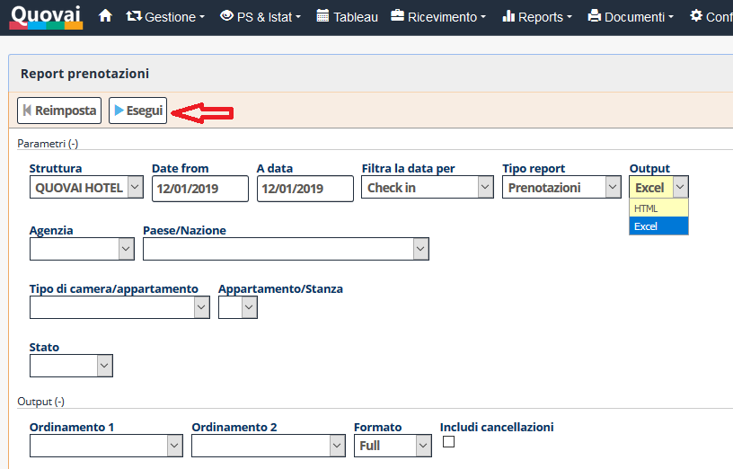
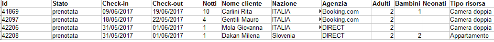

[Indice](index.md) / [Quovai PMS](quovai-pms-it.md) / Come esportare un report in Excel o OpenOffice

# Come esportare un report in Excel / OpenOffice

I report creati su QUOVAI possono essere visualizzati a video e stampati oppure **esportati in Excel o OpenOffice**. In particolare, per la sua versatilità, è consigliato l'utilizzo di **OpenOffice**.

**Importante:** Per esportare un report in Excel o OpenOffice è necessario avere almeno uno dei due programmi installati sul computer. Excel è un programma proprietario di Microsoft e richiede l'acquisto di una licenza. OpenOffice è un programma open source, sostanzialmente equivalente ad Excel, che può essere scaricato da: [http://www.openoffice.org/it/](http://www.openoffice.org/it/).

Per accedere ai report, si clicca su Reports.

Per esportare un report direttamente su Excel o OpenOffice è necessario selezionare la modalità di output HTML o EXCEL e quindi eseguire il report tramite il pulsante Esegui.

Il sistema proporrà di aprire il file generato con OpenOffice, oppure Excel. Vedremo di seguito il caso dell'apertura con OpenOffice. Premendo su OK il sistema procede all'importazione del file in OpenOffice (o Excel). 

Il file può essere quindi elaborato come un normale file Excel inserendo formattazioni, calcoli, etc...

