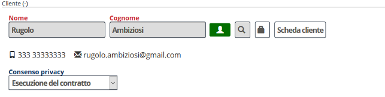
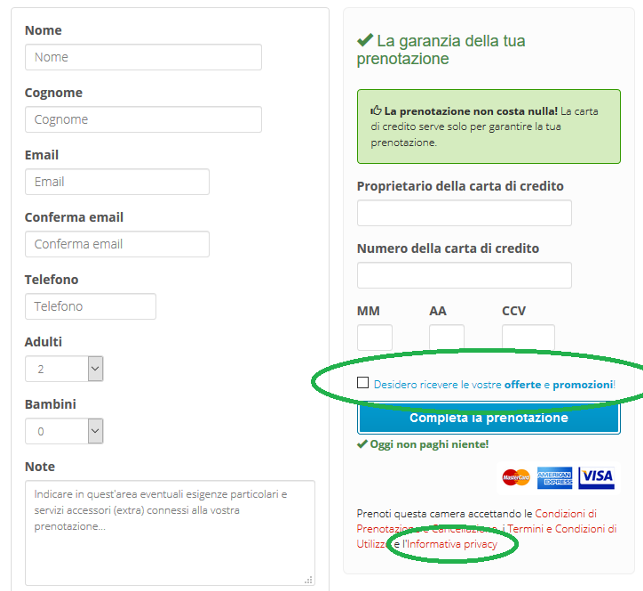
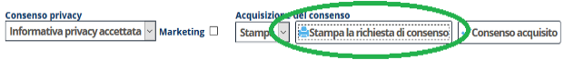
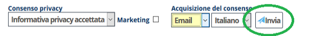
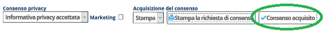

[Indice](index.md) / [Quovai PMS](quovai-pms-it.md) / Come funziona la privacy con Quovai PMS

# Come funziona la privacy con Quovai PMS

## Prima del check-in

### In fase di prenotazione telefonica e/o da channel manager o portali.

Le prenotazioni che inserite manualmente tutti i giorni o che arrivano dai portali tramite il channel manager, vengono salvate nel gestionale e il sistema imposta il consenso privacy a “esecuzione del contratto”. Questo significa che registrate i dati nel gestionale solo al fine di poter fornire un servizio contrattualizzato con il cliente (es. una prenotazione) e che allo scadere di questo servizio (es. dopo il check-out) i dati verranno anonimizzati.

In futuro implementeremo una funzionalità che vi consentirà di richiedere il consenso privacy del cliente via email già in questa fase!

### Le prenotazioni via booking engine

Per le prenotazioni ricevute tramite il vostro sito con il booking engine di Quovai il cliente avrà già visualizzato l'informativa privacy e dato il consenso a conservare i dati per un periodo più lungo come definito nell'informativa privacy. Eventualmente il cliente avrà anche già dato il consenso a ricevere informazioni commerciali.

## Al check-in

Al check-in, per le prenotazioni inserite manualmente (email, telefono, di persona) o ricevute tramite il channel manager, sarà vostra cura raccogliere il consenso del cliente a conservare i dati per un periodo più lungo ed eventualmente a ricevere materiale promozionale.

 -  Mostrerete al cliente un foglio prestampato con la Vostra informativa privacy (guardate per un esempio la nostra informativa standard: Configurazione → Strutture → → Modello informativa privacy) ed eventualmente offrirete di lasciargliene una copia.
 -  A questo punto chiederete al cliente il consenso a conservare i dati nel gestionale e potrete scegliere tra due modalità di acquisire tale consenso:
 - Stampando un foglio preparato dal gestionale e facendolo firmare al cliente. 
 
 
 
 - Inviando al cliente una mail che lo informa del consenso che avete registrato.
    

In caso di consenso firmato su carta, registrerete all'interno del gestionale la scelta del cliente.

## Al check-out

Dopo 5 giorni che il cliente avrà lasciato la vostra struttura, se non avrete raccolto il consenso all'informativa privacy, i dati del cliente e dei suoi famigliari verranno anonimizzati. In pratica verranno sbiancati eventuali dati riguardanti:

-   Telefono e/o cellulare
-   Email
-   Codice fiscale
-   Partita IVA
-   Luogo e data di nascita
-   N. documento di identità 
-   Indirizzo (città , via e cap)

Prima che i dati vengano anonimizzati, riceverete una mail (giornaliera) di riassunto, che vi avvisa riguardo a quali sono i dati per i quali non avete il consenso privacy e che verranno anonimizzati il giorno successivo.

## Cosa succede ai dati delle carte di credito?

I dati relativi alle carte di credito salvati dentro il booking engine di Quovai PMS vengono sempre cancellati 5 giorni dopo il check-out.

## Cosa posso fare con i dati per i quali ho il consenso all'informativa privacy?

Potrete conservare e trattare tali dati in accordo con quanto definito nell'informativa privacy. Se non avete un consenso esplicito per effettuare attività di marketing non potrete inviare comunicazioni commerciali ai clienti.

## Cosa posso fare con i dati per i quali ho il consenso esplicito a ricevere materiale promozionale?

Con questi dati potrete effettuare invio di newsletters, materiale promozionale e offerte speciali come definito all'interno dell'informativa privacy.

***Attenzione!** Le informazioni contenute in questo documento ed in generale in tutti i documenti rilasciato da Quovai riguardanti argomenti connessi ad aspetti legali hanno valore puramente tecnico e sono il frutto dell'interpretazione data da Quovai alla norma di legge nazionale o comunitaria. Le nostre informazioni non sostituiscono una consulenza specialistica in materia legale e non costituiscono parere legale. La Struttura Ricettiva è in ultima analisi responsabile delle modalità di trattamento dei dati per proprio conto e può eventualmente rivolgersi ad un consulente di fiducia per ottenere indicazioni puntuali sui comportamenti da seguire.*