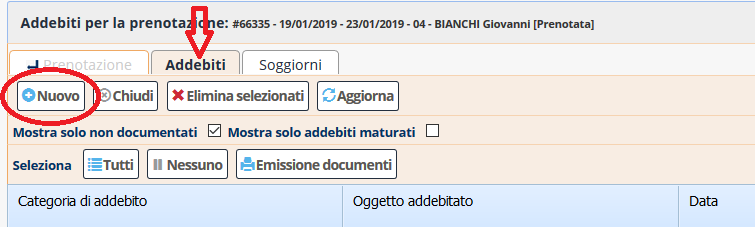
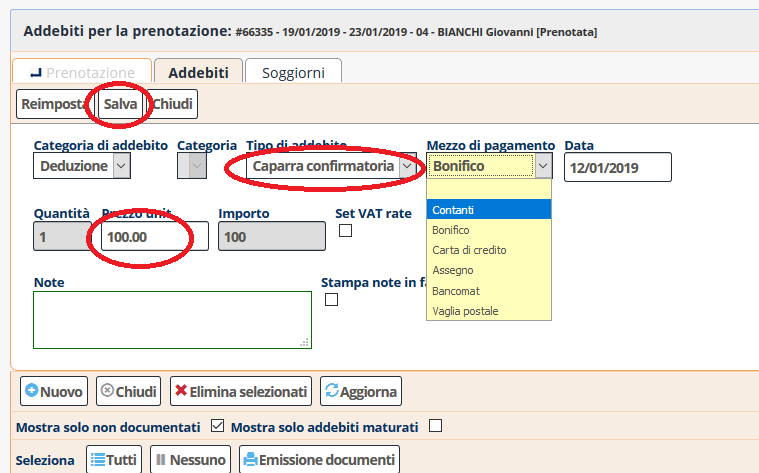

[Indice](index.md) / [Quovai PMS](quovai-pms-it.md) / Come inserire una caparra

# Come inserire una caparra

All'interno della scheda della prenotazione si va nella sezione "Addebiti", si seleziona "Nuovo"

e si inserisce una nuova "Deduzione" sotto "Categoria di addebito", scegliendo "Caparra confirmatoria" come tipologia di addebito:

Con "Salva" l'addebito viene registrato.
 
 