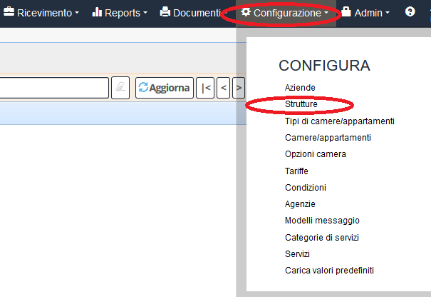
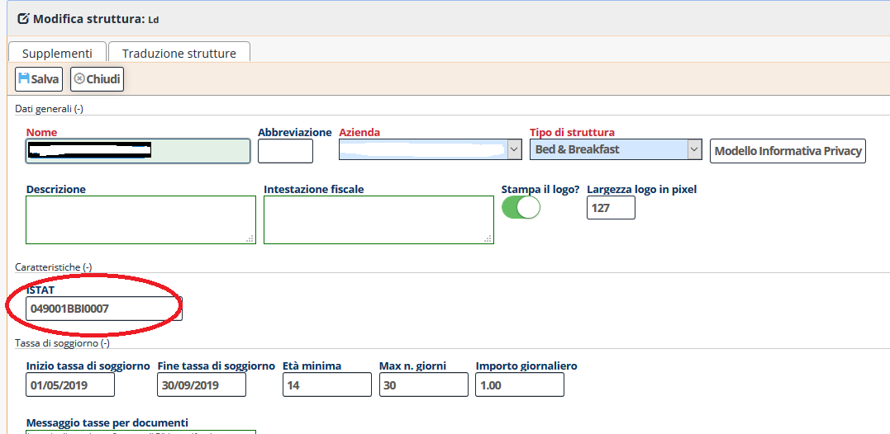

 [Indice](index.html) / Come modificare il codice ISTAT della propria struttura?

# Come modificare il codice ISTAT della propria struttura?

Entrare nella sezione “Configurazione” e clicca su "Strutture"

Si trova la scheda che contiene la voce ISTAT sotto "Caratteristiche"
 

Si può inserire o modificare il codice ISTAT.
