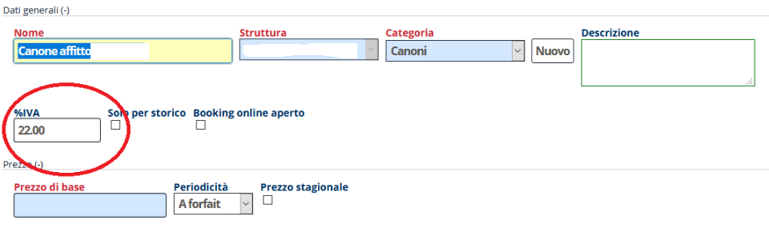

[Indice](index.md) / [Quovai PMS](quovai-pms-it.md) / Come utilizzare un'aliquota IVA diversa

# Come utilizzare un'aliquota IVA diversa

In generale, le fatture relative ai soggiorni presso le strutture ricettive (ed ai servizi collegati) vengono fatturate con un IVA del 10%. 

In alcuni casi particolari, naturalmente, può essere necessario fatturare alcuni servizi con un'aliquota IVA del 22% oppure con aliquota 0 (esente IVA).
Ecco 

Nel caso si debba solo occasionalmente **modificare l'aliquota IVA di un determinato servizio addebitato** è possibile agire direttamente sull'addebito, modificando l'aliquota IVA.

Nella scheda dell'addebito (all'interno della prenotazione), è possibile modificare l'**aliquota IVA:**

Si sceglie "Set VAT rate" (al momento la frase non è tradotta, ci scusiamo): 

 

Si conferma che si intende modificare l'aliquota IVA:

 

Si cambia il valore come necessario:

    

Nei cai in cui invece si debba spesso **effettuare un determinato tipo di addebito al 22% invece che al 10%**, è possibile modificare la percentuale direttamente al menu:

**Configurazione -> Servizi**

Scegliendo il servizio da modificare e cambiando l'**aliquota standard**.

    
  
Utilizzando tale servizio negli addebiti l'aliquota sarà al 22%.
