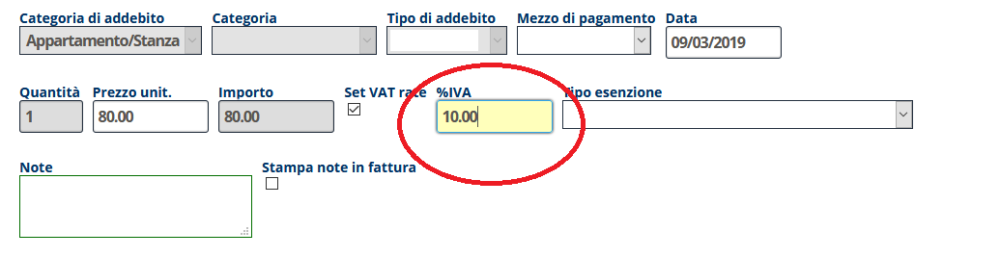

[Indice](index.md) / [Quovai PMS](quovai-pms-it.md) / Come si fa a fatturare con un'aliquota IVA diversa

# Come si fa a fatturare con un'aliquota IVA diversa

**1)** Questa procedura si tratta di una **modifica temporanea solo per una volta**.

All'interno dell'addebito (per la prenotazione), si può modificare l'**aliquota dell'IVA:*

  
  
  

  

     

**2)** Se invece si tratta di un addebito **che viene effettuato spesso e sempre al per esempio 22% invece che al 10%**, è possibile modificare la percentuale direttamente sotto:

**Configurazione -> Servizi**

Scegliendo il servizio da modificare e cambiando l'**aliquota standard**.

     
  
Utilizzando tale servizio negli addebiti l'aliquota sarà al 22%.