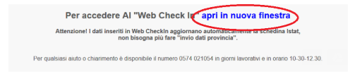
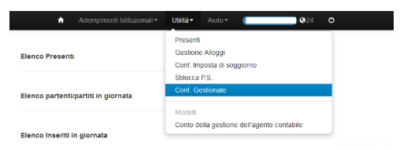
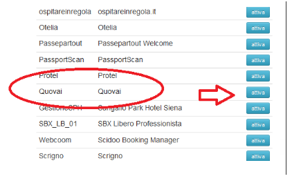
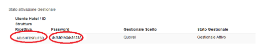
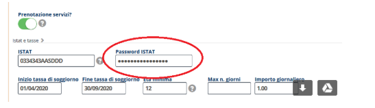
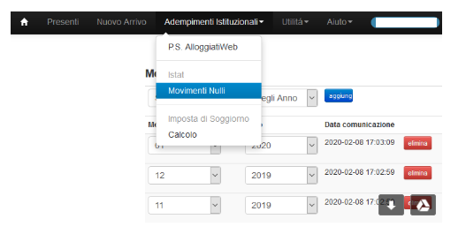

[Indice](index.html) / [Quovai PMS](quovai-pms-it.md) / **Come viene configurato invio ISTAT (Ricestat per Toscana) da Quovai PMS?**

## Come viene configurato invio ISTAT (Ricestat per Toscana) da Quovai PMS?

Ecco le istruzioni per **configurare invio ISTAT da Quovai PMS per la regione Toscana (Pisa, Siena, Livorno, Grosseto, Arezzo, Lucca, Massa Carrara).**

1) Collegarsi al **Ricestat** per la propria provincia con le proprie credenziali.

2) Cliccare su web check-in

3) Cliccare su "Apri in una nuova finestra"

4) Dal menu utilità selezionare "Configurazione gestionale"

5) Dalla lista di gestionali scegliete "Quovai" e cliccate su "Attiva"

6) Il sistema vi comunica che avete scelto Quovai e vi indica il vostro id struttura ISTAT e una password. Copiate questi dati (non copiate gli spazi!) e aprite Quovai PMS.

7) In Quovai PMS andate su Configurazione / Struttura e inserite la password ISTAT all'interno del box dedicato:

8) Inviate sul web check-in eventuali **movimenti nulli per i mesi passati** dalla fine della stagione a oggi (l'invio di movimenti nulli deve sempre essere fatto dall'interfaccia del web check-in).

9) Avvisateci della configurazione completata e abiliteremo il servizio.

Dal momento dell'abilitazione i movimenti verranno inviati **ogni giorno**. Le eventuali cancellazioni o prenotazioni eliminate elimineranno i relativi movimenti. Eventuali cambiamenti nella durata del soggiorno o l'eliminazione o aggiunta di ospiti avverranno in automatico.

**Importante**: SOLO le prenotazioni in stato di **check-in** vengono inviate all'ISTAT. Se iniziate ad usare questa funzionalità, quindi, è importante che facciate il check-in/check-out di tutte le prenotazioni e che inseriate gli ospiti all'interno della sezione soggiorni (questo vi aiuterà anche nella compilazione del file PS).