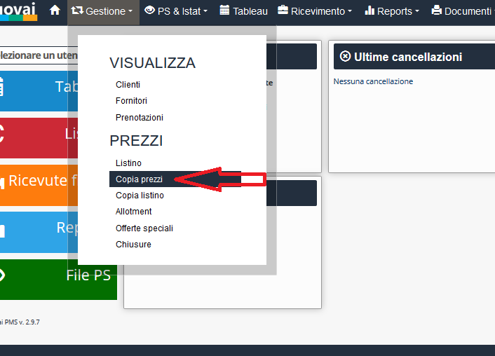
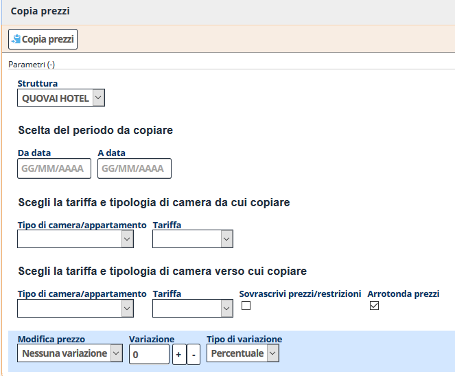
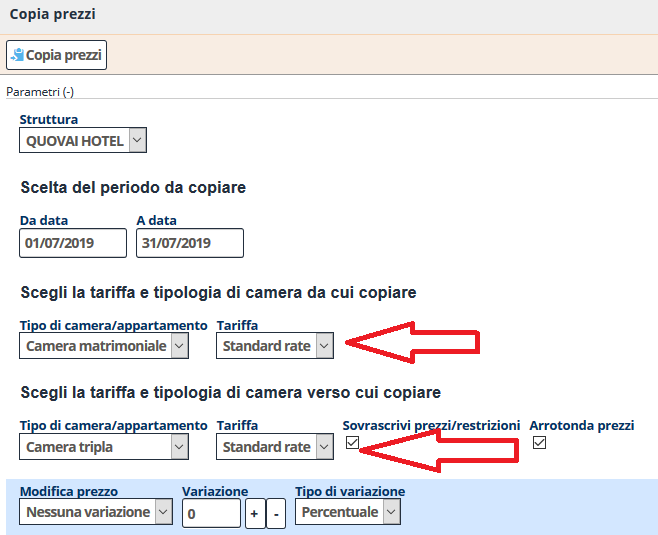
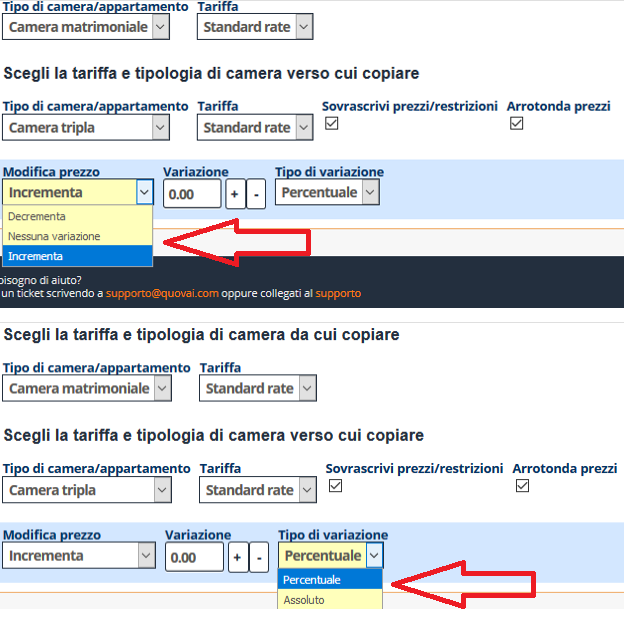
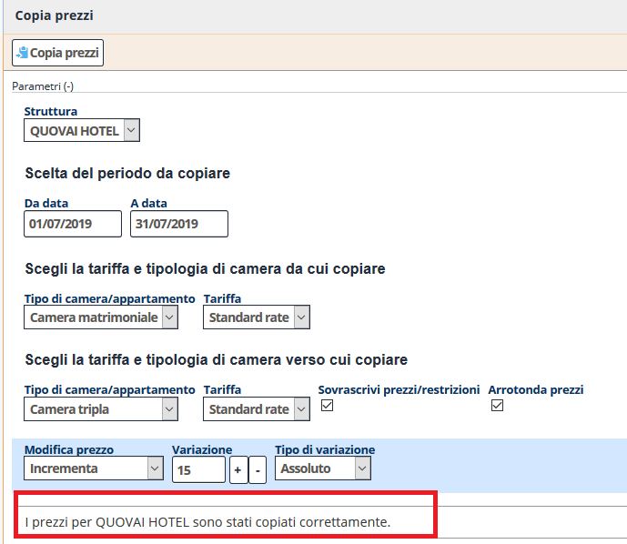

[Indice](index.md) / [Quovai PMS](quovai-pms-it.md) / Copiare i prezzi

# Copiare i prezzi

Per copiare i prezzi, devi cliccare su **Gestione** poi sotto PREZZI si trova la voce **Copia prezzi**.

Dopo pochi istanti appare il modulo per iniziare a copiare i prezzi: 

Devi scegliere la tariffa e tipologia di camera **da cui copiare** e poi la tariffa e tipologia di camera **verso cui copiare**:
 
  

Poi è possibile modificare i prezzi (**decrementa, nessuna variazione, incrementa**) e variare i prezzi (**percentuale o assoluto (€)**) usando il bottone variazione (+ o -).

 

Premeremo poi su **Copia prezzi**.

Viene fuori in basso la dicitura: I prezzi per QUOVAI HOTEL sono stati copiati correttamente.

 
