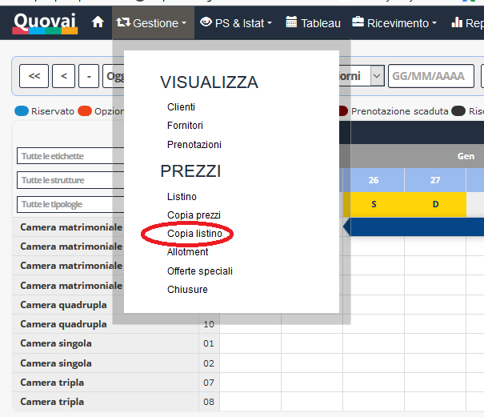
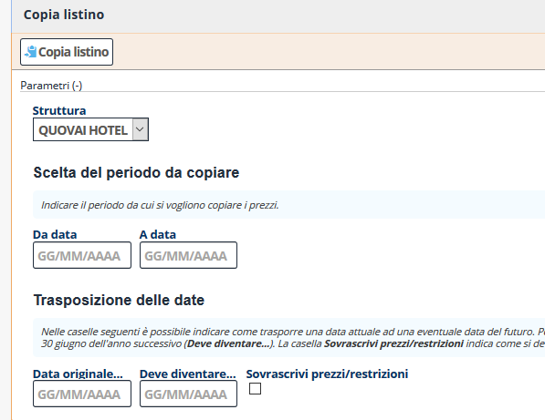
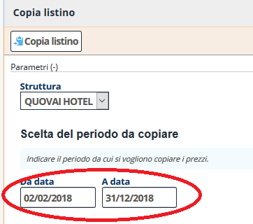
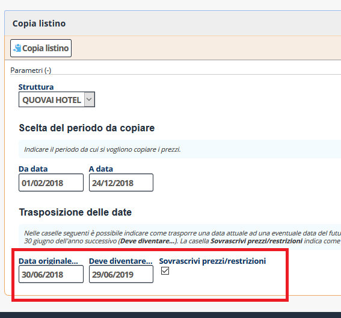
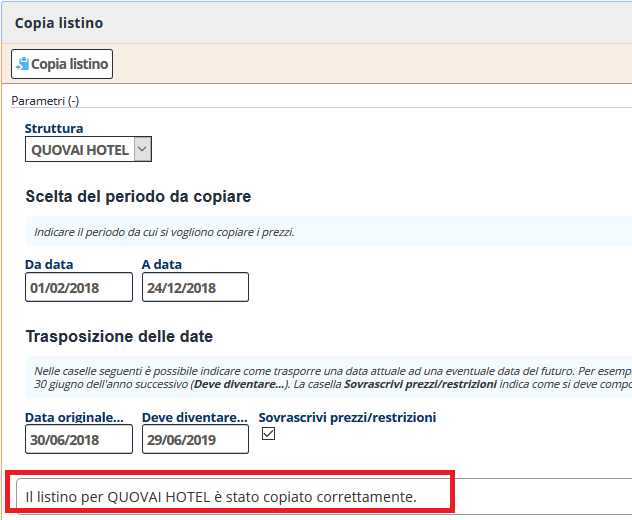

[Indice](index.md) / [Quovai PMS](quovai-pms-it.md) / Copiare il listino da una stagione all'altra

# Copiare il listino da una stagione all'altra

Per copiare il tuo listino da un anno all'altro, devi cliccare su **Gestione** poi sotto PREZZI si trova la voce **Copia listino**.

Dopo pochi istanti appare il modulo per iniziare a copiare il listino: 

 

Devi indicare il periodo da cui si vogliono copiare i prezzi.

 

Poi è possibile indicare come trasporre una data attuale ad una eventuale data del futuro. Per esempio, se quest'anno il 1° luglio è un Sabato e l'anno successivo il 1° luglio è una Domenica, per conservare l'allineamento del calendario potremmo dire che vorremmo far corrispondere il Sabato 1° luglio di quest'anno (**Data originale...**) al Sabato 30 giugno dell'anno successivo (**Deve diventare...**). La casella **Sovrascrivi prezzi/restrizioni** indica come si deve comportare il sistema in caso nel periodo verso cui si vuole copiare il listino, esistano già definiti prezzi e restrizioni. 

 

Premeremo poi su **Copia listino**.

Viene fuori in basso la dicitura: Il listino per QUOVAI HOTEL è stato copiato correttamente.

 
