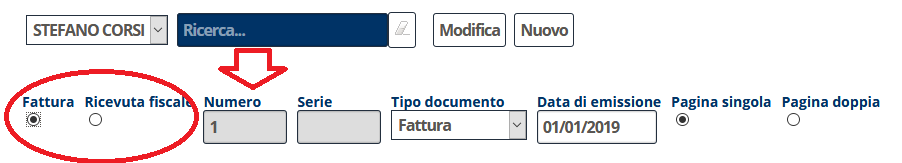

[Indice](index.html) / Creare una fattura

# Creare una fattura

## Entrare nella sezione "addebiti"

Entrando nella prenotazione si clicca sulla scheda "Addebiti" che contiene tutte le voci di conto della prenotazione.

Nella sezione addebiti, cliccando sul tasto "Tutti", si selezionano tutti gli addebiti per l'inserimento in fattura.

Cliccando quindi su "Emissione documenti" si apre la sezione riassuntiva del documento.

Si seleziona "Fattura". La numerazione viene re-impostata di conseguenza.

Cliccando su "Anterprima" si passa all'anteprima della fattura. E' possibile che il sistema vi comunichi il messaggio:

> Mancano le seguenti informazioni per il cliente: Via, Comune, CAP,
> Nazione, Provincia/Stato, P. IV

E' quindi necessario entrare nella scheda cliente ed inserire le informazioni necessarie.

Nella scheda cliente è necessario inserire innanzitutto i dati fiscali:

 - Partiva IVA
 - Codice destinatario (o PEC)

**Se si tratta di un'azienda** il cliente va modificato come "Azienda" e va inserita la ragione sociale. 

**Se invece si tratta di un professionista** può rimanere registrato come "Privato".

Deve essere inserito l'indirizzo.

Cliccando su "Anteprima" questa volta non si ottiene alcun messaggio di errore e si procede all'anteprima del documento.

Cliccando su "Emissione e stampa" la fattura viene emessa ed è disponibile nella sezione **Documenti -> Fatture emesse**.

Le fatture emesse vengono inviate al sistema di interscambio (SDI) dopo 25 minuti.

