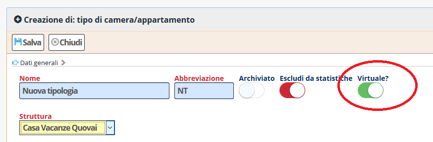
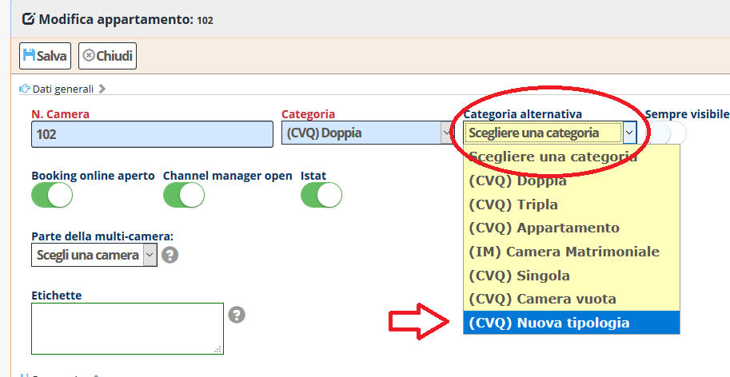
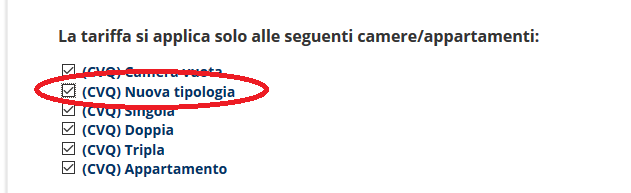
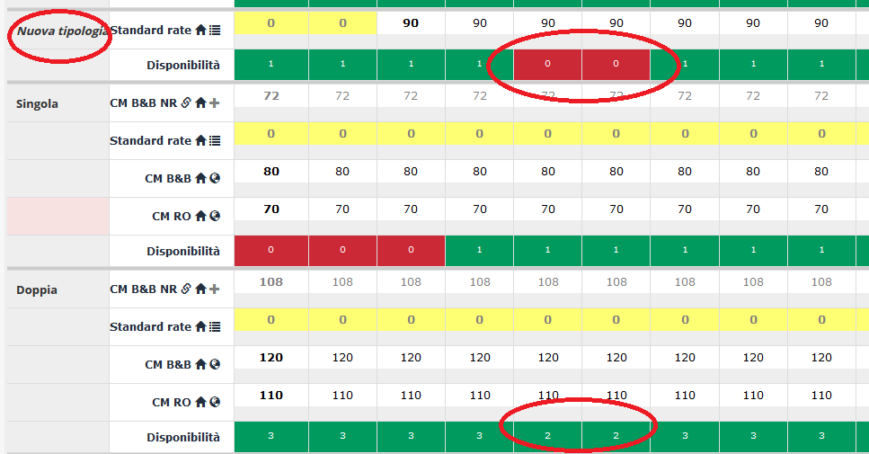

[Indice](index.html) / **Creare una tipologia virtuale**

# Creare una tipologia virtuale

Una tipologia virtuale è una tipologia di camera che non ha camere assegnate sul tableau, ma che viene associata ad alcune camere (spesso una sola) per poterle vendere separatamente sul *booking engine* o sui canali.

I pratica, una tipologia virtuale, è una tipologia che si utilizza solo in fase di vendita, non nella gestione operativa della struttura, è un modo per vendere la struttura diversamente da come la si gestisce.

## Alcuni esempi

Se abbiamo 10 bilocali venduti per tipologia su un OTA (es. booking.com) e vogliamo venderne due per camera su un altro portale (es. Airbnb), possiamo creare due tipologie virtuali per i due bilocali che vogliamo vendere per camera e possiamo quindi collegarli al channel manager in modo indipendente.

Altro esempio: se abbiamo 4 camere doppie e 2 triple, ma vogliamo che in certe situazioni particolari le triple vengano vendute come doppie, possiamo creare una tipologia virtuale "Doppia confort" alternativa alla tipologia "Doppia" principale e mettere le triple nella nuova tipologia. In questo modo sarà possibile, in certi momenti, aprire la nuova tipologia virtuale e vendere le camere con il nome alternativo.

## Come fare?

### Step 1 creare una tipologia e marcarla come virtuale

Creare una nuova tipologia, con il nome e le caratteristiche desiderate, e definirla come *Virtuale*.

*Configurazione / Tipi di camere e appartamenti / <modifica tipo camera appartamento>*

Potrebbe essere utile selezionare *Escludi da statistiche* per evitare che la nuova tipologia influisca sui conteggi dei vari report.

### Step 2 associare una camera alla tipologia virtuale

Entrare nella configurazione di una camera, assegnare la camera alla tipologia alternativa appena creata.

*Configurazione / Camere e appartamenti / <modifica camera appartamento>*

### Step 3 associare la nuova categoria alle tariffe

Essendo una nuova tipologia in tutto e per tutto, la tipologia appena creata deve essere associata alle relative tariffe.

*Configurazione / Tariffe / <modifica tariffa>*

### Step 4 verificare sul listino e assegnare prezzi e portali

Sul listino, la nuova categoria è apparsa e riporta la disponibilità della camera che è stata assegnata. Possiamo assegnare prezzi, restrizioni e portali come per una normale categoria.

Il nome della tipologia virtuale viene mostrato sul listino in corsivo. La tipologia può essere gestita, per quanto riguarda prezzi, restrizioni, canali, come una normale tipologia. Solo la disponibilità viene presa dalla/e camera/e assegnate alla tipologia come alternativa.

