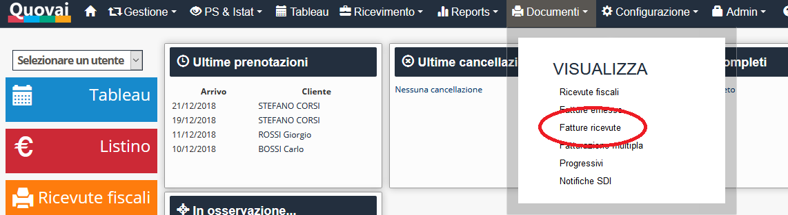
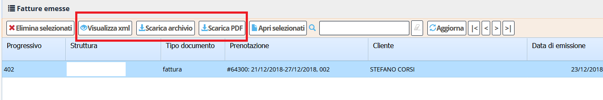
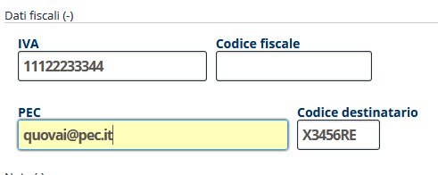
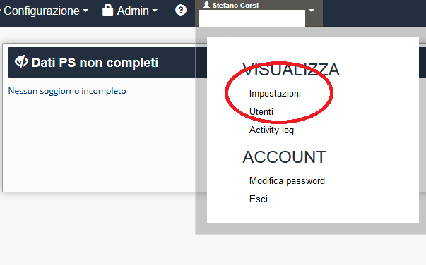
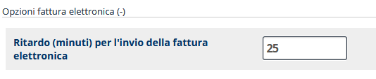

[Indice](index.md) / [Quovai PMS](quovai-pms-it.md) / Fatturazione elettronica

# La fatturazione elettronica con Quovai PMS

## Introduzione
La fatturazione elettronica, inizialmente introdotta soltanto per le fatture verso le pubbliche amministrazioni, è obbligatoria dal 1/1/2019 anche per le fatture emesse da aziende private verso aziende private (B2B).

Sostanzialmente, invece di recapitare un documento cartaceo o PDF, viene inviato ad un sistema centrale dell'Agenzia Entrate (chiamato SDI: sistema di interscambio) un file in formato **xml** che rappresenta in tutto e per tutto la fattura che le aziende erano abituate a produrre in passato.

## Come viene gestita la fatturazione elettronica in Quovai PMS
Quovai PMS implementa:

 - la ricezione delle fatture elettroniche dai fornitori
 - l'invio delle fatture elettroniche ai clienti
 - la firma digitale delle fatture elettroniche
 - la conservazione sostitutiva a norma di legge

## Ricevere le fatture elettroniche

Per ricevere le fatture elettroniche è necessario (oltre ad aver aderito al servizio contattando il Supporto Clienti) **comunicare il codice destinatario** di Quovai PMS (vedi più avanti) al proprio Commercialista in modo che tale codice sia registrato nel sito dell'Agenzia dell'Entrate. Qualora siate in possesso di credenziali entrate o altro accesso diretto ai servizi telematici, potrete effettuare direttamente tale registrazione collegandovi al sito dell'Agenzia dedicato a tale scopo: https://ivaservizi.agenziaentrate.gov.it/portale/.

Il codice destinatario da comunicare è:

**HM3K1R8**

E' anche possibile comunicare volta per volta il codice destinatario al fornitore, anche se tale operazione non è comoda e può comportare degli errori.

### Il menu fatture ricevute
Nel menu **Documenti** la voce *Fatture ricevute* vi porterà alla lista delle fatture che i vostri fornitori vi hanno inviato.

Selezionando uno o più documenti sarà possibile accedere alle funzionalità che vi mostrano il dettaglio delle fatture elettroniche ricevute:

 - Visualizzare l'XML di una fattura elettronica
 - Scaricare un archivio **.zip** contenente l'XML per multiple fatture elettroniche
 - Visualizzare un PDF di una fattura elettronica
 

In generale, non è necessario stampare e conservare le fatture elettroniche. Il sistema è concepito in modo che, in qualsiasi momento, voi possiate recuperare una delle fatture emesse o ricevute negli ultimi 10 anni.

#### La procedura consigliata per le fatture ricevute
Noi consigliamo di:

 - Visitare periodicamente il menu **Documenti -> Fatture ricevute** per verificare se vi sono nuove fatture in arrivo.
 - Controllare le nuove fatture arrivate eventualmente visualizzandole in PDF
 - Alla fine del mese passare l'archivio .zip delle fatture ricevute nel mese al proprio commercialista (oppure utilizzare un programma messo a disposizione dallo stesso per registrarle nel sistema).

## Inviare le fatture elettroniche
Per inviare le fatture elettroniche, sarà necessario avere a disposizione uno o l'altro dei seguenti dati del fornitore:

 - Il codice destinatario
 - la PEC

Il **codice destinatario** è un codice che può essere lungo 7 caratteri (in caso di soggetto privato) o 6 caratteri (in caso di pubblica amministrazione). Ad es. **XXE4R4A** oppure **ERT45E**.
La **PEC** è simile un normale indirizzo email che di solito (ma non è un requisito) contiene la parola pec: es. **quovai@pec.it**.

Quando si emette una fattura il sistema verificherà che almeno uno dei dati riportati di sopra sia valorizzato nell'anagrafica cliente.

### Fase I - creare la fattura

La fattura viene creata nella stessa identica modalità utilizzata sinora e può anche essere stampata (possibilmente su carta non fiscale) e consegnata al cliente.

Una volta creata, la fattura è visibile nell'elenco di fatture pronte all'invio (Documenti -> Fatture emesse).

### Fase II - invio della fattura
Nell'elenco delle fatture emesse è possibile visualizzare alcuni dati importanti per la gestione delle fatture elettroniche:

 - Lo stato dell'invio (che può essere "**Inviato"**, "**Non inviato"**, "**n/a"** oppure "**ERRORE"**.
 - Lo stato SDI relativo all'esito della fattura sul Sistema di Interscambio. Può essre: **-** (Nessun messaggio), **NS** (Notifica di scarto), **MT** (File metadati), **RC** (Ricevuta consegna), **MC** (Mancata consegna), **EC** (Esito committente), **SE** (Scarto esito committente), **NE** (Notifica esito), **DT** (Notifica decorrenza), **AT** (Attestazione trasmissione)
 - Il tempo mancante al tentativo di Invio

Quovai PMS invia le fatture dopo un tempo definito nel menu **impostazioni**.

Questo tempo è impostato di default a 25 minuti ma può essere modificato manualmente dall'utente.

Nella lista delle fatture emesse è possibile osservare tra quanto tempo il documento verrà inviato elettronicamente.

#### Annullare una fattura
E' possibile eliminare una fattura solo se non è ancora stata inviata (quindi se "Stato invio" è "Da inviare" oppure "n/a" oppure "ERRORE").

In caso si desideri annullare una fattura dopo l'invio, è possibile:

 - Attendere un eventuale scarto dallo SDI che quindi annullerebbe di fatto la fattura
 - Emettere una nota di credito

