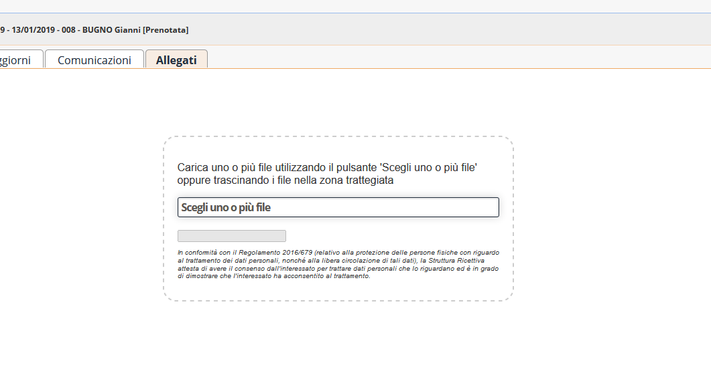
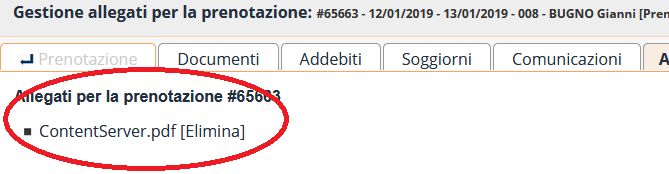

[Indice](index.html) / [Quovai PMS](quovai-pms-it.md) / Gestire allegati

## La gestione degli allegati

Quovai PMS consente di allegare ad una prenotazione uno o più file.

Una nuova scheda è apparsa nella prenotazione:

Nella scheda allegati è disponibile un'area per caricare i file da associare alla prenotazione. E' sufficiente trascinare un file sull'area per poter caricare un file sul gestionale e associarlo alla prenotazione:

Una volta caricato il file è visibile nella lista degli allegati:

Gli allegati sono visibili anche nella scheda principale della prenotazione.

E' possibile eliminare l'allegato o visualizzarne il contenuto.

Gli allegati sono conservati in modo sicuro e cifrato sul server.

