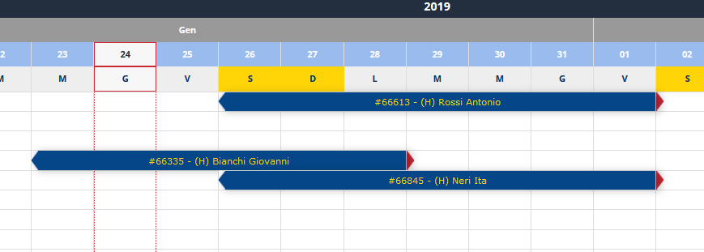
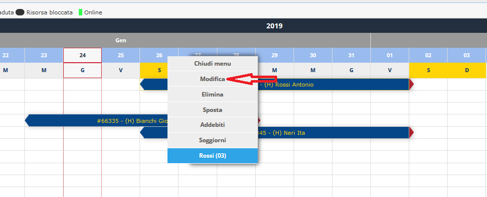
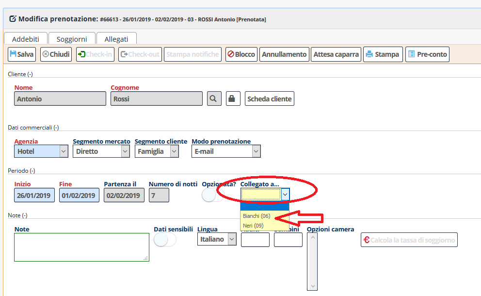

[Indice](index.md) / [Quovai PMS](quovai-pms-it.md) / Gruppi e prenotazioni collegati

# Gruppi e prenotazioni collegati 

 Clicca su **Gestione** e poi **Tableau**. 

Per esempio, abbiamo delle prenotazioni come nella schermata: 

Clicca su una prenotazione (la chiamiamo Master - #66613) poi la voce **modifica**:

 Appare il modulo da compilare. Clicca su **Collegato a**... Associamo la prenotazione #666845 alla prenotazione

  
Se vogliamo anche associare una terza prenotazione, clicca su prenotazione #66335 e clicca sullo stesso bottone di prima. Si collegano le prenotazioni fra di loro.
 

 
Alla fine dell’operazione, premi **Salva**.