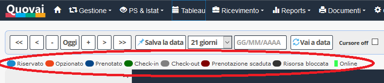

[Indice](index.html) / I colori del tableau

# I colori del tableau
  
Abbiamo vari tipi di colori diversi a seconda dello stato della camera/dell'appartamento:

 - **Riservato** è la camera/l'appartamento in attesa di conferma con caparra confirmatoria
 
 - **Opzionato** è la camera/l'appartamento prenotata/o sulla quale viene inserito una scadenza opzione. Alla scadenza della data di opzione verrà chiesto la conferma o la disdetta.
 
 - **Prenotato** è la camera/l'appartamento prenotata con assegnazione fisica della prenotazione. 
 
 - **Check-in** è il giorno di arrivo dell'ospite quando la camera/l'appartamento viene occupata/o. 
 
 - **Check out** è il giorno di partenza dell'ospite quando la camera/l'appartamento viene liberata/o.

 - **Prenotazione scaduta** è il giorno di partenza dell'ospite quando la camera/l'appartamento viene liberata/o.
 
 -  **Risorsa bloccata** non si può accedere alla camera/all'appartamento perché è bloccata/o per un altro motivo.
 
 - **Online** significa la camera/l'appartamento è stata/o prenotata/o tramite il booking engine.
 
 A breve sarà possibile personalizzare i colori.
