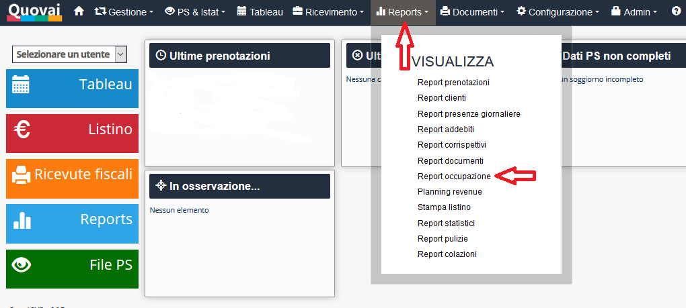
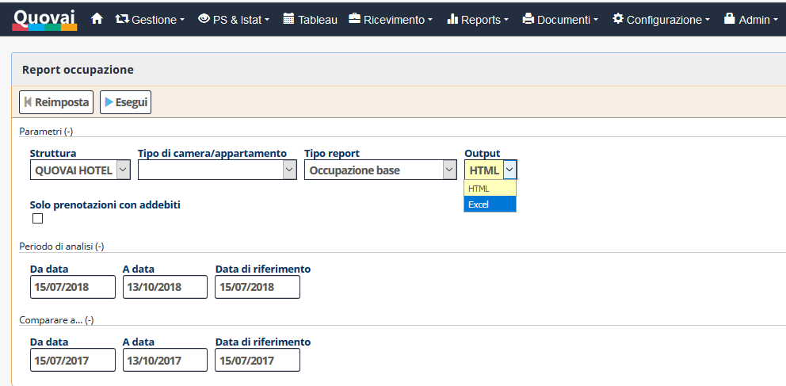
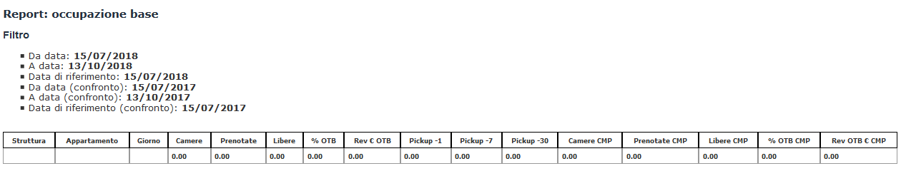

[Indice](index.html) / [Quovai PMS](quovai-pms-it.md) / Il report occupazione - Come sto andando quest'anno?

# Il Report occupazione - Come sto andando quest'anno?

Il report occupazione è un report che vi permette di confrontare il vostro andamento per un certo periodo (es. luglio e agosto) con lo stesso periodo dell'anno precedente.

E' possibile accedere al report dal menu Reports > Report occupazione.

Nel modulo di interrogazione potete specificare il periodo di analisi (il periodo per cui volete vedere l'andamento), la data di riferimento (il momento di osservazione, di solito la data odierna) e il periodo di confronto (per esempio lo stesso periodo dell'anno precedente) con la relativa data di riferimento.

Il report può essere visualizzato nella versione di dettaglio (occupazione base) e nella versione aggregata per tipologia di camera (occupazione per tipologia). Quest'ultima, probabilmente, è quella che la maggior parte delle strutture troverà più utile.

Nel risultato del report è possibile vedere alcune metriche, tra le quali le più importanti sono:

-   Camere (camere disponibili)
-   Prenotate (camere prenotate)
-   Libere (camere libere)
-   % OTB (percentuale di occupazione)
-   Rev € OTB (ricavi da prenotazioni)

Le metriche sono disponibili per il periodo di analisi e per il periodo di confronto.

Cliccando su Esegui il report viene eseguito.