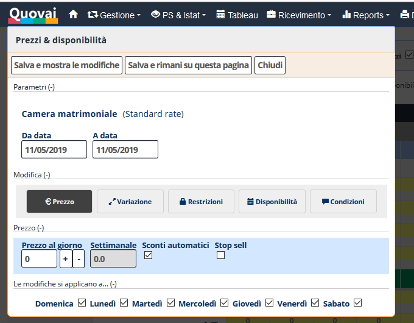

[Indice](index.md) / [Quovai PMS](quovai-pms-it.md) / Impostare i prezzi

# Impostare i prezzi
 
 Clicca su **Gestione** e poi **Listino**.  

Appare il tableau per iniziare ad impostare o variare i tuoi prezzi. Per prima cosa, avrai già definito [le tue tariffe](https://quovai.github.io/impostare-le-tariffe-it.html). 

**Esempio**: sul tableau, scegli camera matrimoniale e lo standard rate, doppia clicca sulla data di interesse (con il mouse sinistro) e appare il modulo per l’inserimento (o per eventualmente variare) dei prezzi.

**Salve dopo ogni operazione.**

Chiariamo alcune nozioni:

**Da data a data:** inserisci la data d'interesse o un intervallo con l'aiuto di un calendario.

**Prezzo:** inserisci il tuo prezzo. Con il '**+**' e il '**-**', puoi rapidamente aggiustare il prezzo. Il prezzo settimanale viene calcolato automaticamente.

**Variazione:** puoi variare il prezzo di un certo valore fisso o percentuale.

**Restrizioni:** come minimum stay, giorno di arrivo o giorno di partenza.  

**Disponibilità:** del tuo inventario sul tuo booking engine (sito web) e sul channel manager.  

**Condizioni:** fa riferimento [alle condizioni](https://quovai.github.io/impostare-le-condizioni-it.html) che hai già definite. 

 
 