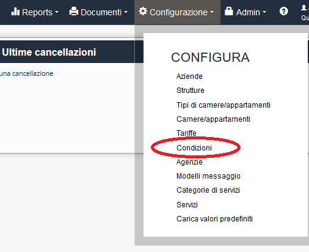
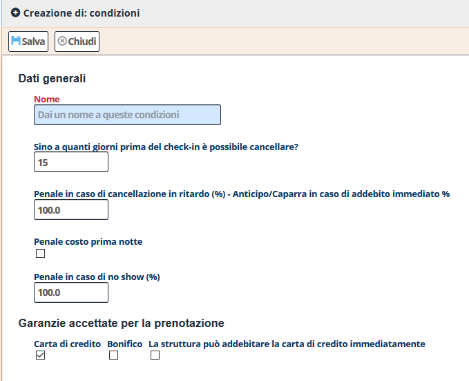

[Indice](index.html) / [Quovai PMS](quovai-pms-it.md) / Impostare le condizioni

# Impostare le condizioni
 
 Clicca su **Configurazione** e poi **Condizioni**. Le condizioni riferiscono alle condizioni di cancellazione, rimborsabilità e pagamento.

Poi sotto **Lista Condizioni** clicca su **Nuovo**.

Appare il modulo per iniziare ad impostare le condizioni.   

Per quanto riguarda **Dati generali**:

**Nome:** riferisce al nome della condizione (esempio: base, media stagione, alta stagione ecc).
  
Da inserire **i dati** secondo la politica della struttura ricettiva : 
 
 - Sino a quanti giorni prima del check-in è possibile cancellare?  
 - Penale in caso di cancellazione in ritardo (%) - Anticipo/Caparra in caso di addebito immediato %
 - Penale costo prima notte
 - Penale in caso di no show (%)
 - Garanzie accettate per la prenotazione: a scelta fra Carta di credito / Bonifico / La struttura può addebitare la carta di credito immediatamente
  