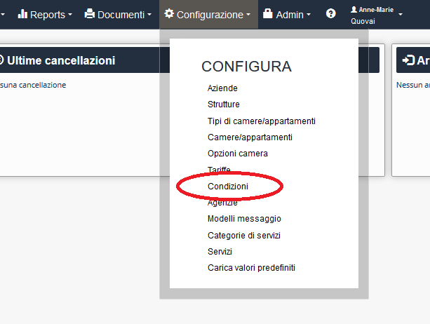

[Indice](index.md) / [Quovai PMS](quovai-pms-it.md) / Impostare le restrizioni

# Impostare o variare le restrizioni
 
 Clicca su **Gestione** e poi **Listino**.  

Appare il tableau per iniziare ad impostare o variare i prezzi, la disponibilità, le restrizioni, le condizioni ecc.

Si trova la voce **Restrizioni:** 

Le restrizioni sono strumenti tattici necessari a controllare la domanda. Sono: lunghezza minima di soggiorno; CTA – Close to Arrival (chiuso agli arrivi); CTD – Close to Departure (chiuso alle partenze). 