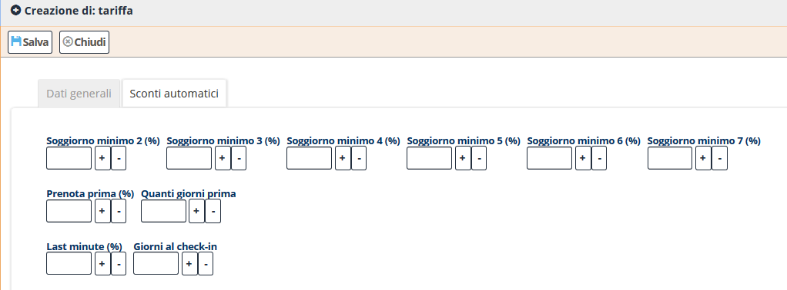

[Indice](index.md) / [Quovai PMS](quovai-pms-it.md) / Impostare le tariffe

# Impostare le tariffe
 
 Clicca su **Configurazione** e poi **Tariffe**.  

Poi sotto **Lista Tariffa** clicca su **Nuovo**.

Dopo pochi istanti appare il modulo per iniziare ad impostare le tariffe:

Ci sono 2 voci: Dati generali e Sconti automatici.

Chiariamo alcune nozioni di base per quanto riguarda **Dati generali**:
**Nome:** riferisce al nome della tariffa (standard rate, settimanale, rimborsabile, non-rimborsabile ecc).
**Tipo tariffa:** ci sono tre tipi (1) per camera/appartamento (2) per persona (3) per camera/appartamento e persona.
**Trattamento**: riferisce alle differenti tipologie di trattamento come 'solo pernottamento', 'bed & breakfast', 'mezza pensione' e 'pensione completa'.
**Non rimborsabile**: caratteristica di una prenotazione la quale, in caso di cancellazione non prevede la rimborsabilità della somma versata. 
**Ordinamento:** il modo di presentare le varie tariffe nel listino. Per esempio, standard rate - inserisci 10; 7 notti - inserisci 20; booking com standard rate - inserisci 30 ecc... per avere l'ordinamento: standard rate, 7 notti, booking com standard rate ecc. 
 
 

**Archiviato**: mettendo il segno, gestisce ed archivia le vecchie tariffe. Possono essere ripristinate togliendo il segno.

**Tariffa channel manager:** fa riferimento al sistema che gestisce i canali distributivi online per l’aggiornamento di disponibilità e tariffe. Il sistema opera in tempo reale e simultaneamente a seconda della selezione del cliente sul periodo, sulle camere e sui dati da aggiornare.

**Tariffa derivata:** tariffe che vengono derivate dalla tariffa Master (tariffa dalla quale vengono derivate una o più tariffe). Esempio può essere la tariffa Mezza Pensione, ricavata dalla bed & breakfast, tariffa Master, con un'aggiunta di quota di prezzo (percentuale o in valore numerico). Ovviamente vale viceversa.

**Vincola all'occupazione**: la tariffa e il prezzo sono da intendersi per l'esatto numeri di componenti nella camera/nell'appartamento. 

Per quanto riguarda: **Sconti automatici**, ci sono tre tipi: soggiorno minimo, prenota prima e last minute.

 