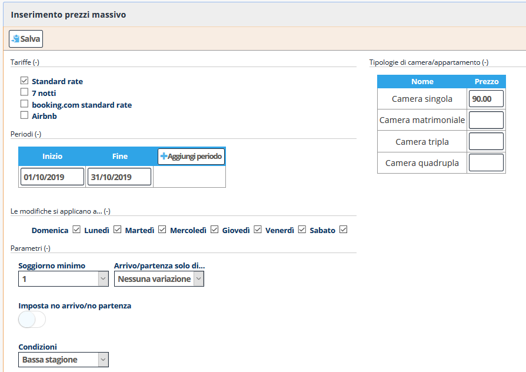

Indice](index.md) / [Quovai PMS](quovai-pms-it.md) / **Inserimento prezzi massivo**

# **Inserimento prezzi massivo**

Scegliendo dal menù contestuale la funzionalità **Inserimento prezzi massivo** è possibile creare un listino per ogni tipologia camera/appartamento attraverso un'unica interfaccia per risparmiare tempo. 

Si può anche accedere alla funzionalità tramite il bottone **"Inserimento massivo"** presente sulla pagina del listino.

**Occorre:** 

1. Andare in Gestione -> **Inserimento prezzi** massivo o tramite la pagina del listino cliccando su **Inserimento massivo**, troverà la maschera seguente:

2.  Cliccare la tariffa da aggiungere.
3.  Inserire il prezzo per la tipologia camera/appartamento.
4.  Definire il periodo (dal...al). Il bottone "Aggiungi periodo" vi permette
5.  Decidere di applicare le modifiche a tutti i giorni della settimana.
6.  Scegliere i parametri che possono essere modificati: soggiorno minimo, arrivo/partenza solo di... / e condizioni (per esempio: alta stagione, bassa stagione...)

