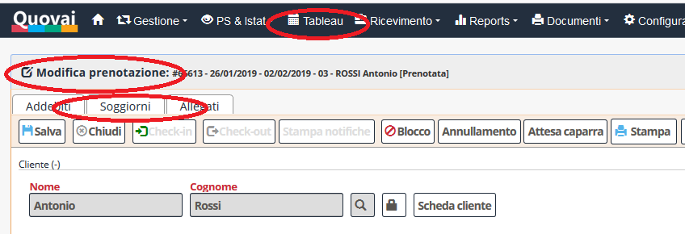
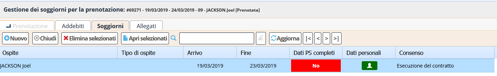

 [Indice](index.md) / [Quovai PMS](quovai-pms-it.md) / Inserimento dei soggiorni

#  Inserimento dei soggiorni

I "soggiorni" della prenotazione differiscono dal "cliente". I "soggiorni" sono gli ospiti che effettivamente soggiornano nella camera/appartamento e per i quali verrà effettuata la notifica PS.

Per inserire i soggiorni si entra nella scheda della prenotazione e si clicca sulla linguetta "Soggiorni".

Nella sezione "Soggiorni" è possibile inserire un nuovo soggiorno premendo il tasto "Nuovo". N.B. In caso la prenotazione sia stata effettuata da un cliente privato, tale cliente viene inserito in automatico come primo soggiorno.

Di solito, i dati PS non sono completi per questo primo cliente. Questo è evidenziato dal campo rosso "Dati PS completi" che mostra il valore "No".

Facendo doppio click sull'ospite, si entra nella scheda di compilazione dei dati del cliente.

Di solito il primo ospite sarà indicato come "OSPITE SINGOLO" oppure come "CAPOFAMIGLIA" o "CAPOGRUPPO". Per quest'ospite sarà necessario indicare i dati PS completi:

*N.B. ci si muove velocemente tra i vari campi utilizzando il tasto TAB. Una volta che il cursore è uscito da un campo, una serie di automatismi scattano per facilitare l'inserimento.*

Una volta inserito il primo ospite, è possibile inserire gli altri ospiti cliccando su "Nuovo". 

Per il nuovo ospite si potrà indicare "FAMIGLIARE" o "MEMBRO GRUPPO". I dati da compilare saranno ridotti rispetto al capofamiglia o capogruppo e alcuni campi (es. la provincia di residenza) saranno precompilati.

Una volta salvato anche il famigliare o membro del gruppo, si potrà vedere che tutti i dati saranno pronti per la creazione del file per l'invio PS. Il file viene di solito creato alla fine della giornata, con tutti i dati degli ospiti della giornata.

