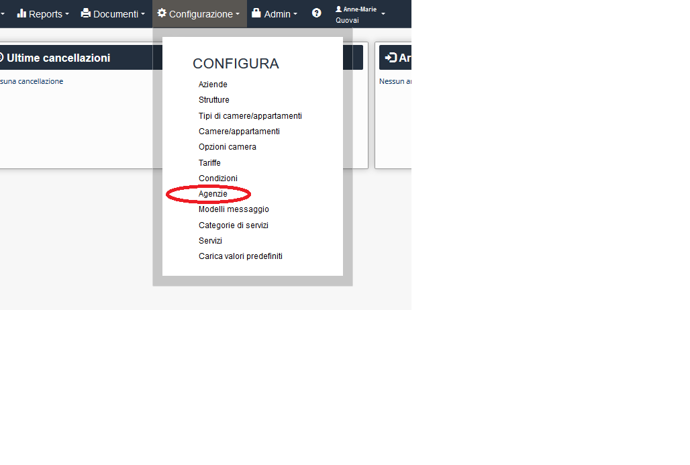
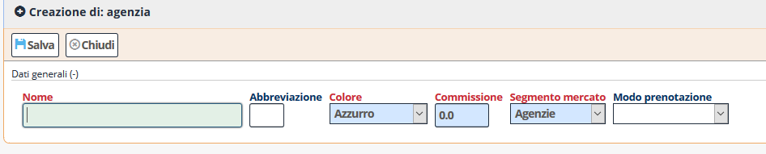

[Indice](index.md) / [Quovai PMS](quovai-pms-it.md) / Introdurre le agenzie

# Introdurre le agenzie

*Le agenzie fungono da intermediario tra il cliente e il fornitore del servizio, richiedendo per questo una provvigione. Può essere di tipo "verticale" o "orizzontale": la Agenzia "verticale" vende un solo tipo di servizio (solo ricettività, solo trasporti, ecc.), la Agenzia "orizzontale" vende servizi di vario genere (ricettività, trasporti, noleggio, crociere, pacchetti, ecc.).*

Clicca su **Configurazione** e poi **Agenzie**.  

  

Appare il modulo per iniziare ad impostare le agenzie. 

  

Alla fine dell'operazione, premi su **salva**.