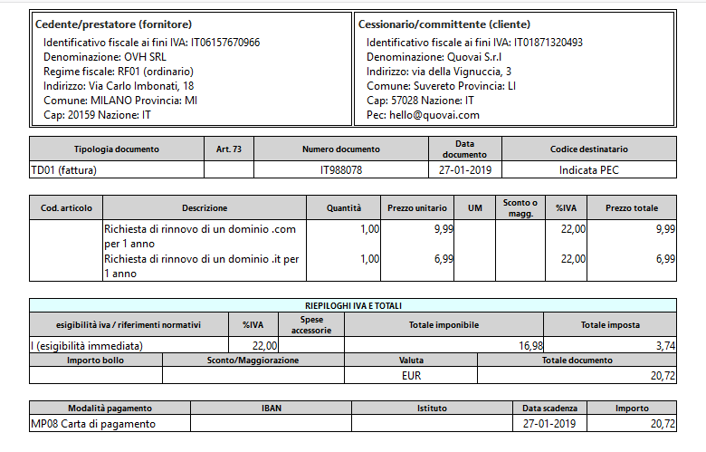

[Indice](index.md) / [Quovai PMS](quovai-pms-it.md) / ***Copia cortesia delle fatture passive in entrata***

# Copia cortesia delle fatture passive 

E' possibile generare una stampa in formato leggibile delle fatture ricevute dai fornitori.

Vai in **Documenti** e poi **fatture ricevute** (funziona anche con quelle emesse, in ogni caso...):

Seleziona una fattura e poi clicca su **Visualizza xml**

La visualizzazione, come potrai vedere, è quella di una fattura più "normale".

Per stamparla o salvarla in PDF, utilizza la combinazione di tasti **ctrl-p**.