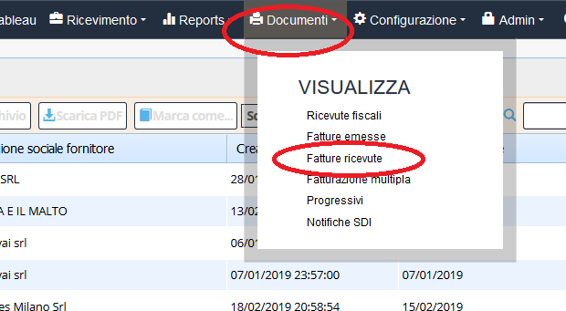
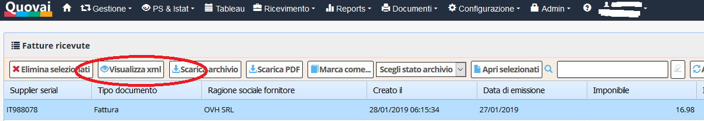

[Indice](index.md) / [Quovai PMS](quovai-pms-it.md) / Copia cortesia delle fatture passive in entrata

# Copia cortesia delle fatture passive 
 
Generiamo una stampa formato xml in formato leggibile per rispondere alle esigenze per le fatture passive in entrata ed in uscita.

Vai in Documenti e poi fatture ricevute (funziona anche con quelle emesse, in ogni caso...):

 
Seleziona una fattura e poi clicca su Visualizza xml

La visualizzazione, come potrai vedere, è quella di una fattura più "normale".