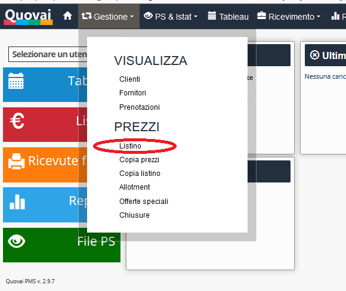
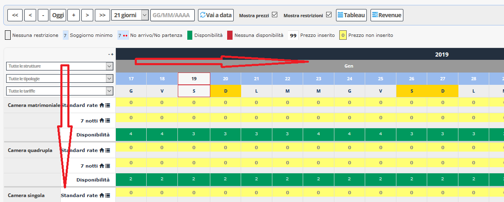

[Indice](index.md) / [Quovai PMS](quovai-pms-it.md) / La gestione del listino

# La gestione del listino (aspetti generali)

Per accedere al listino, clicca su **Gestione** e poi **Listino**.

 
Dopo pochi istanti appare il listino. Sull'asse **orizzontale** ci sono i giorni della settimana/il mese/l'anno e sull'asse **verticale** ci sono le camere/gli appartamenti o gli alloggi da vendere, le tariffe e la disponibilità.

 
Chiariamo alcune nozioni: 

 - **Il prezzo** è l'importo a cui viene venduto una camera/un appartamento/un alloggio per una data combinazione di tariffa e giorno. 
 - **La tariffa** o **rate** (termine anglosassone) abbina le condizioni di prenotazione ed un trattamento come pernottamento, B&B rimborsabile, non rimborsabile, settimanale ecc. e rappresenta la base su cui la struttura ricettiva costruisce la sua piramide di prezzi.
 - **La tipologia** riferisce al tipo di camera/appartamento/alloggio in vendita.
 
Una volta che hai definito le tariffe, è il momento di pianificare i prezzi da applicare al fine di essere competitivo e profittevole.
 
 