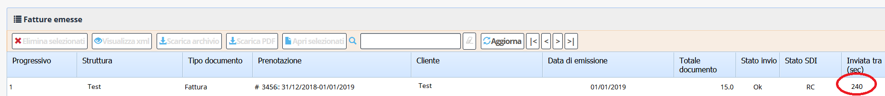
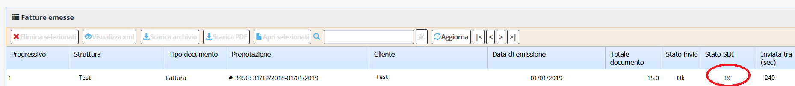

[Indice](index.md) / [Quovai PMS](quovai-pms-it.md) / La lista fatture emesse

# La lista fatture emesse

Selezionando [Indice](index.md) / [Quovai PMS](quovai-pms-it.md) / La lista fatture emesse

# La lista fatture emesse

Selezionando **Documenti -> fatture emesse** si arriva alla lista delle fatture emesse.

Per ogni documento è possibile vedere se la fattura è ancora da inviare e quanto tempo (in secondi) manca prima che il sistema la invii al sistema di interscambio:

Prima che la fattura sia inviata è ancora possibile eliminarla (ricordandosi naturalmente di riportare indietro il progressivo).

Quando la fattura viene effettvamente inviata (e quindi non sarà più possibile eliminarla) vedrete comparire un OK sulla colonna dello "Stato invio".

A questo punto la fattura è stata inviata al sistema di interscambio ma ancora non è stata gestita (validata, recapitata, etc...). 

Quando questo succederà (al momento in cui scriviamo passano alcuni secondi, ma ci potrebbero volere anche decine di minuti a seconda del carico), vedrete comparire RC (ricevuta di consegna) sulla colonna "Stato SDI".

Cliccando sulla riga della fattura emessa, si attivano i bottoni che permettono di visualizzarne o scaricarne il contenuto in diversi formati:

 - xml
 - archivio zip
 - pdf

L'**xml** è il formato su cui si basa tutta la fatturazione elettronica e potrebbe esservi utile qualora vi venga richiesto di inviare un file xml (al commercialista, al cliente, etc...).

L'**archivio zip** serve di solito per inviare un lotto di fatture al commercialista o a chi tiene la contabilità.

Il **PDF** serve se si vuole tenere una copia stampata della fattura inviata (cosa che a) non è necessaria e b) noi sconsigliamo per evitare il consumo di carta). Il PDF serve anche per visualizzare una fattura in formato più leggibile.

