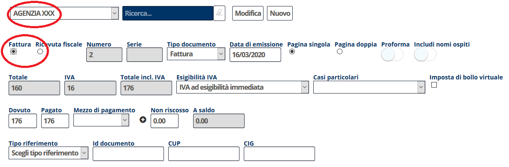
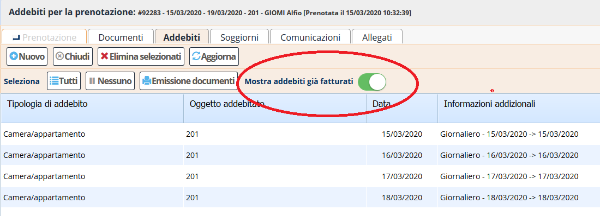
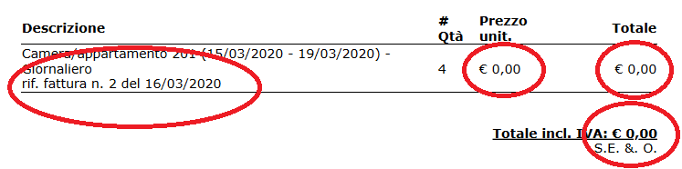
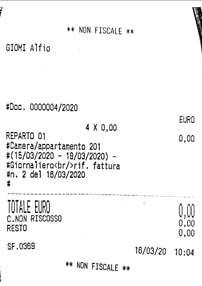
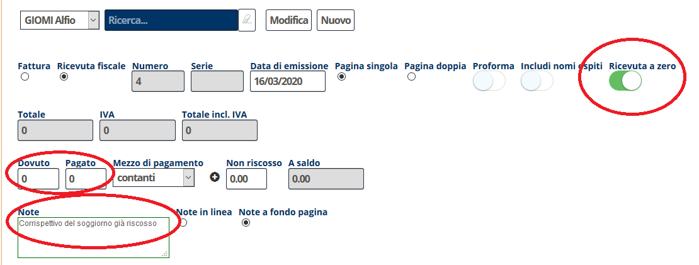
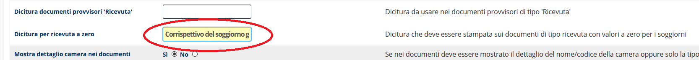
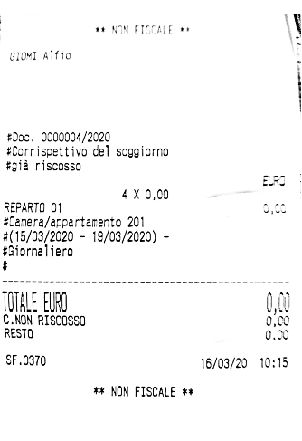

[Indice](index.html) / La ricevuta a zero, con e senza documento precedente

# Fare una ricevuta a zero al cliente per prenotazioni prepagate o pagate in seguito dall'agenzia

In certe situazioni può essere opportuno fare la cosiddetta *ricevuta a zero* al cliente, ovvero una ricevuta dove gli importi dei soggiorni sono valorizzati a zero.

- Nei casi in cui la prenotazione sia stata pagata da un'agenzia e il cliente non debba pagare nulla e sia già stata emessa fattura all'agenzia
- Nei casi in cui la prenotazione verrà pagata dall'agenzia e verrà fatturata in seguito alla stessa.

Per coprire questi due casi si utilizzano diverse modalità.

## Quando si emette fattura all'agenzia e ricevuta a zero al cliente

In questi casi, si selezionano gli addebiti della prenotazione e si emette, innanzitutto, fattura all'agenzia. Questo può accadere molto tempo prima dell'arrivo del cliente oppure pochi giorni prima o anche contestualmente. 

Quindi, dopo aver emesso la fattura all'agenzia, all'arrivo o alla partenza del cliente si emette a quest'ultimo una ricevuta, selezionando il tasto Mostra addebiti già fatturati

e **rifatturando** al cliente gli addebiti che sono già stati fatturati all'agenzia. 

In questo modo all'interno del documento, che riporterà gli importi dei soggiorni a zero, verrà stampato un riferimento al documento originale (la fattura all'agenzia) che permetterà di ricostruire fiscalmente l'intero giro di fatturazione.

Le stesse operazioni si applicano naturalmente, ora che siamo in regime di scontrino elettronico, anche alle ricevute stampate su Registratori Telematici RT.

## Quando la fattura all'agenzia verrà fatta in seguito

In alcuni casi, il cliente arriverà e partirà prima che venga fatta la fattura del soggiorno all'agenzia. In questi casi non è possibile utilizzare il metodo precedente perché non esiste un documento sottostante.

In tal caso, dovendo fornire un documento fiscale al cliente, si entra nella sezione addebiti, si selezionano tutti gli addebiti e si entra nella fase di emissione del documento. Una flag "Ricevuta a zero" vi consentirà a questo punto di emettere una ricevuta al cliente con gli importi azzerati.

La ricevuta riporterà la dicitura Corrispettivo del soggiorno già riscosso che può essere modificata eventualmente secondo le indicazioni del proprio commercialista utilizzando il menu Impostazioni modificando a piacere il campo dicitura per ricevuta a zero.

Ecco come appare, sullo scontrino, questo secondo tipo di ricevuta.

