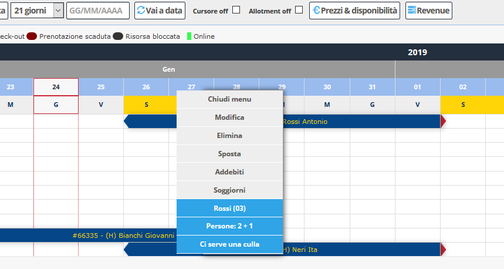

[Indice](index.md) / [Quovai PMS](quovai-pms-it.md) / Menu contestuale della prenotazione

# Menu contestuale della prenotazione

Clicca su **Tableau** e poi sulla prenotazione per vedere il **menu contestuale** della prenotazione.

Ci sono le seguenti possibilità: 
 - Chiudi menu  
 - Modifica  
 - Elimina  
 - Sposta  
 - Addebiti  
 - Soggiorno

In basso, c'è un **breve riassunto della prenotazione**: cognome dell'ospite / numero di camera / numero di persone / riassunto delle note
 
 
 