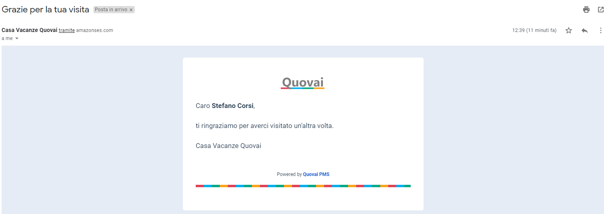
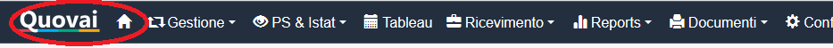

[Indice](index.md) / [Quovai PMS](quovai-pms-it.md) / Messaggi email dal PMS

# **Abbiamo migliorato i messaggi email dal PMS**
 
E' ora possibile, quando si invia un messaggio email da uno dei template presenti nel PMS (o che avete creato dal menu Configurazione / Modelli messaggi), modificare a piacere il testo prima dell'invio.  
  
Era una limitazione (ci dispiace!) e ora non c'è più e dovrebbe consentirvi di usare i messaggi in modo più comodo e naturale.  
  
C'è un piccolo video per spiegare di cosa si tratta:  
  
[http://youtu.be/gIH80Ol8pAk?hd=1](https://quovai.us17.list-manage.com/track/click?u=469cd2f9ee673fc3cb5e90eea&id=cd32083105&e=58c2f50f79)  
  
Inoltre abbiamo aggiunto la possibilità di cambiare il layout dei messaggi per renderli più gradevoli, magari con il vostro logo e con un'impaginazione più gradevole.       
  
Se volete utilizzare un modello grafico simile a quello che utilizziamo noi, oppure se volete creare il vostro magari con l'aiuto della vostra web agency, contattateci (come anche se ci fosse qualche problema o dubbio)!  

  

Non dimenticate di ricaricare l'applicazione cliccando sul logo Quovai!  

  