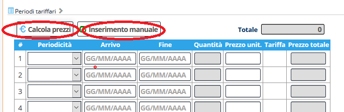

[Indice](index.html) / **Modalità di inserimento prezzi**

## Modalità di inserimento prezzi 

Abbiamo reso più semplice (speriamo) l’inserimento dei prezzi, riducendo il numero di bottoni e introducendo alcuni automatismi.

Ecco come si presenta ora la barra di inserimento prezzi:

Il bottone “suggerimento periodi” è stato sostituito da **Calcola prezzi**.

Il bottone “copia data di inizio e fine” è sparito ma al contempo date e prezzo si resettano automaticamente ogni volta che ce n’è bisogno.

Il prezzo viene calcolato automaticamente se c’è un listino valido, altrimenti l’area di inserimento si predispone per il prezzo a forfait, precompilando i campi.

Il tasto **Inserimento manuale** permettere di forzare l’inserimento manuale di un prezzo preimpostando tutti i campi.