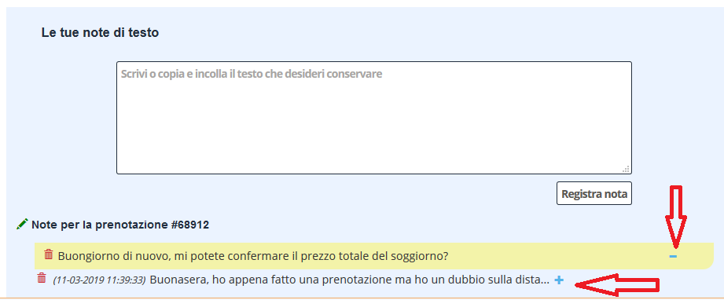

[Indice](index.html) / [Quovai PMS](quovai-pms-it.md) / Note aggiuntive

# Note aggiuntive - le vostre note di testo

E' disponibile una nuova modalità che vi consente di aggiungere un numero arbitrario di testi lunghi brevi alla prenotazione. Questo può servire per esempio per salvare il contenuto di una mail del cliente insieme alla prenotazione, come sicuramente molte volte vi sarà capitato di voler fare.

Per fare questo, occorre entrare nella prenotazione e selezionare il tab "allegati".

  

All'interno del tab allegati troverete una sezione che vi consente di inviare dei file in vari formati (pdf, immagini, txt, etc...) e una sezione che vi consente di incollare direttamente un testo e di vederlo salvato insieme alla prenotazione.

  
  
In quest'ultimo caso, dopo aver incollato il testo, per esempio di una mail, vedrete che nella lista delle note allegate troverete una linea per ogni testo allegato. Cliccando sul tasto "+" espanderete la nota e potrete vedere il testo completo. Cliccando sul tasto "-" tornerete a vedere la nota compressa.

  

  

Cliccando sul "cestino" potrete eliminare la nota (dopo conferma).

**ALLEGATI**
Per quanto riguarda gli allegati di tipo pdf e immagini, invece, cliccando sul nome del file potrete visualizzare il file completo.

   

