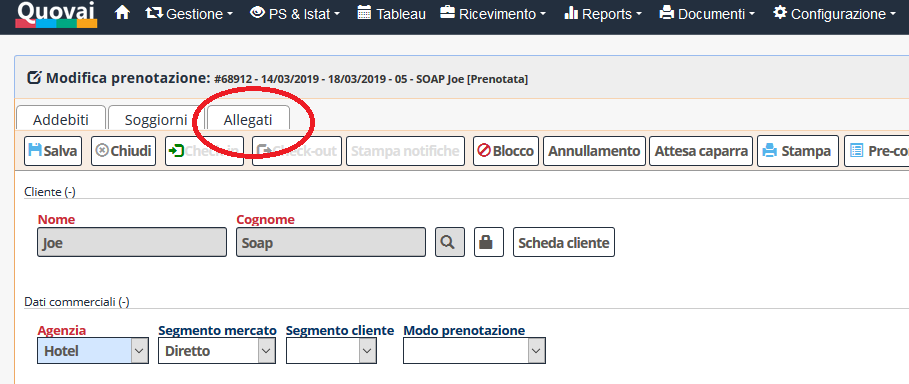
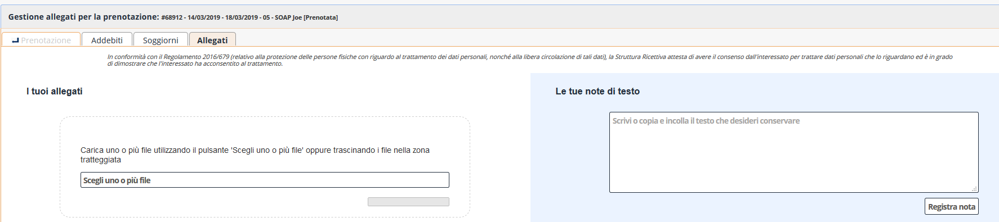
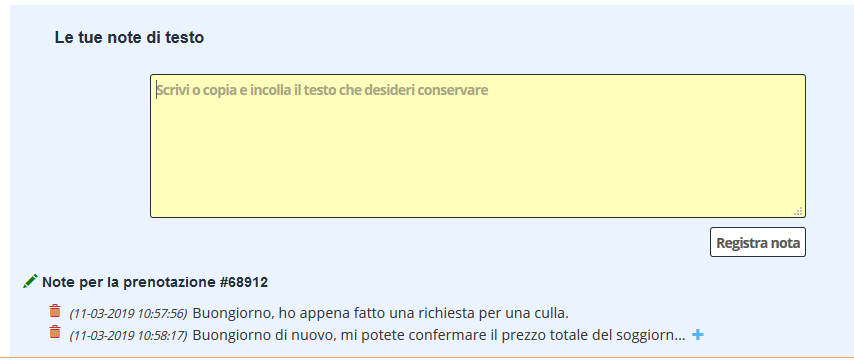
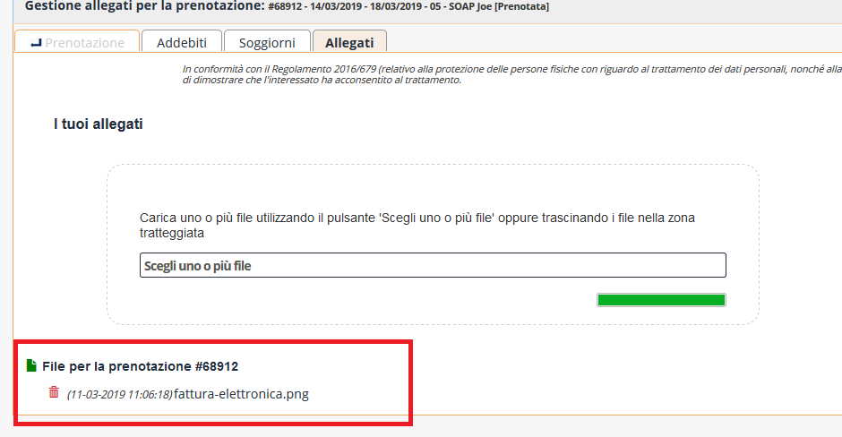

[Indice](index.md) / [Quovai PMS](quovai-pms-it.md) / Note aggiuntive

# Note aggiuntive - le tue note di testo

E' disponibile una nuova modalità che ti consente di aggiungere un numero arbitrario di testi lunghi brevi alla prenotazione. Questo può servire per esempio per salvare il contenuto di una mail del cliente insieme alla prenotazione, come sicuramente molte volte ti sarà capitato di voler fare.

Per fare questo, occorre entrare nella prenotazione e selezionare il tab "allegati".

  

All'interno del tab allegati troverai una sezione che ti consente di inviare dei file in vari formati (pdf, immagini, txt, etc...) e una sezione che ti consente di incollare direttamente un testo e di vederlo salvato insieme alla prenotazione.

  
  
In quest'ultimo caso, dopo aver incollato il testo, per esempio di una mail, vedrai che nella lista delle note allegate vedrai una linea per ogni testo allegato. Cliccando sul tasto "+" espanderai la nota e potrai vedere il testo completo. Cliccando sul tasto "-" tornerai a vedere la nota compressa.

  

Cliccando sul "cestino" potrai eliminare la nota (dopo conferma).

**ALLEGATI**
Per quanto riguarda gli allegati di tipo pdf e immagini, invece, cliccando sul nome del file potrai visualizzare il file completo.

   
