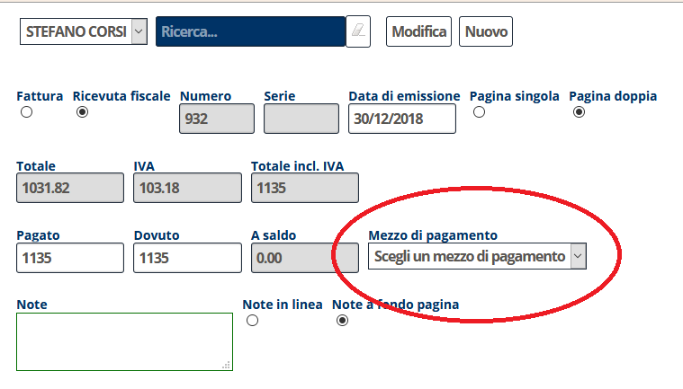

[Indice](index.md) / [Quovai PMS](quovai-pms-it.md) / Le novità introdotte con la fattura elettronica

# Le novità introdotte con la fattura elettronica

## 1. Tipo di pagamento: si specifica per l'intero documento

Mentre è sempre possibile specificare, per riferimento interno, il tipo di pagamento di ogni singolo addebito, il mezzo di pagamento che compare sul documento viene specificato a livello globale del documento e deve essere uno dei mezzzi di pagamento proposti dall'agenzia delle entrate:

| Cod. | Descrizione                                |
|------|--------------------------------------------|
| MP01 | contanti                                   |
| MP02 | assegno                                    |
| MP03 | assegno circolare                          |
| MP04 | contanti presso Tesoreria                  |
| MP05 | bonifico                                   |
| MP06 | vaglia cambiario                           |
| MP07 | bollettino bancario                        |
| MP08 | carta di pagamento                         |
| MP09 | RID                                        |
| MP10 | RID utenze                                 |
| MP11 | RID veloce                                 |
| MP12 | Riba                                       |
| MP13 | MAV                                        |
| MP14 | quietanza erario stato                     |
| MP15 | giroconto su conti di contabilità speciale |
| MP16 | domiciliazione bancaria                    |
| MP17 | domiciliazione postale                     |
| MP18 | bollettino di c/c postale                  |
| MP19 | SEPA Direct Debit                          |
| MP20 | SEPA Direct Debit CORE                     |
| MP21 | SEPA Direct Debit B2B                      |
| MP22 | Trattenuta su somme già riscosse           |

