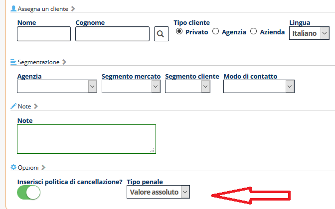

[Indice](index.html) / [Quovai PMS](quovai-pms-it.md) / **Opzioni per preventivi**

## Opzioni per preventivi

E' possibile specificare in un preventivo:

- Se stampare nella mail la policy di cancellazione

- Se la policy di cancellazione è in valore assoluto o percentuale

  

Tutte queste opzioni sono impostabili sia nel singolo preventivo (sezione **Opzioni**) che nelle impostazioni (sezione **Preventivi**).

 

**Maggiore informazioni:**

[Preparare un preventivo]()

[Inviare email in automatico da Quovai]()

