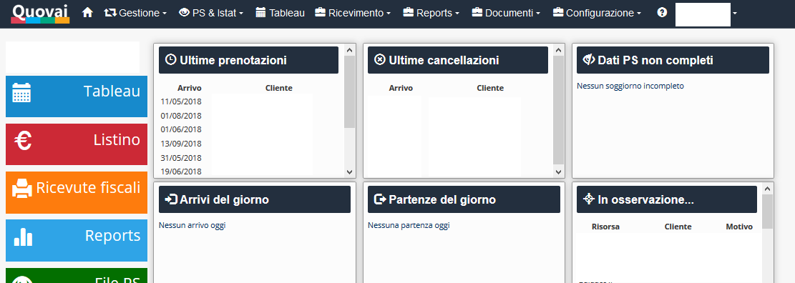

[Indice](index.md) / [Quovai PMS](quovai-pms-it.md) / Il pannello principale

# La dashboard principale

Appena effettuato il collegamento al sistema, vengono presentate alcune informazioni di sintesi che consentono alla struttura di avere un colpo d'occhio sulla situazione delle prenotazioni che richiedono maggiore attenzione.

### **Ultime prenotazioni**

Il riquadro ultime prenotazioni vi consente di visualizzare le ultime prenotazioni effettuate e di accedervi velocemente cliccando sul link corrispondente.

### **Ultime cancellazioni**

Il riquadro ultime cancellazioni vi consente di visualizzare le ultime prenotazioni annullate dalla struttura o cancellate dal cliente e di accedervi velocemente cliccando sul link corrispondente.

### **Dati PS non completi**

Il riquadro dati PS non completi vi elenca i clienti (attesi al check-in) per i quali non sono ancora stati inseriti tutti i dati relativi alla Pubblica Sicurezza.

### **Arrivi del giorno**

Il riquadro arrivi del giorno mostra le prenotazioni in arrivo nella giornata odierna. Cliccando sul link corrispondente alla prenotazione si accede al dettaglio.

### **Partenze del giorno**

Il riquadro partenze del giorno mostra le prenotazioni in partenza nella giornata odierna. Cliccando sul link corrispondente alla prenotazione si accede al dettaglio.

### **In osservazione**

Il riquadro in osservazione mostra le prenotazioni in stato di Riservata o Opzionata che di solito corrispondono a quelle prenotazioni per le quali si attende l'invio della caparra o una risposta da parte del cliente.
