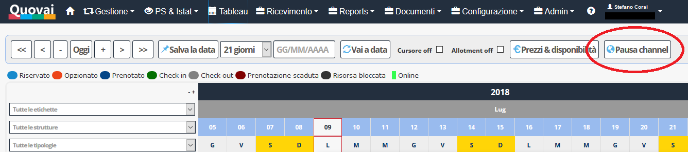

[Indice](index.md) / [Quovai PMS](quovai-pms-it.md) / Funziona di pausa channel manager

# Funziona di pausa channel manager

**Quando c'è pochissima disponibilità**, se devi spostare una camera per qualsiasi motivo, c'è il rischio che mentre fai uno spostamento temporaneo i portali "sentano" che si è liberata una stanza e inviino una prenotazione. Si creerebbe un **overbooking**.

Per evitare che questo succeda, abbiamo creato un bottone "**Pausa channel**" che consente a chi deve fare veloci spostamenti "tecnici" sul tableau di mettere in pausa il channel per 2 minuti, in modo che eventuali "movimenti" temporanei non vengano notificati ai portali.

  

Un esempio: _devo spostare la prenotazione A dall'appartamento 001 al 002 e la prenotazione B dall'appartamento 003 all'appartamento 001._

1) Premo "**Pausa channel**", il bottone diventa disabilitato e mi mostra un conto alla rovescia dei secondi che mancano alla riattivazione del channel. Da questo momento, qualsiasi movimento sul tableau non viene trasmesso ai portali.

2) **Sposto** le prenotazioni

3) **Verifico** che tutto sia a posto

4) **Dopo 120 secondi** (2 minuti) il bottone torna a mostrare "Pausa channel" e io so che eventuali movimenti che farò da questo momento in poi verranno correttamente trasmessi ai portali.

5) Il sistema, per sicurezza, invia **un aggiornamento dei periodi che sono stati modificati** (che però a questo punto rifletteranno la reale situazione della disponibilità).