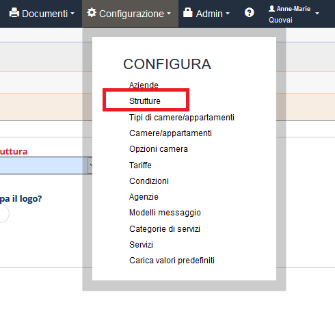
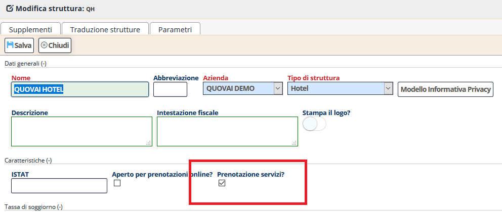
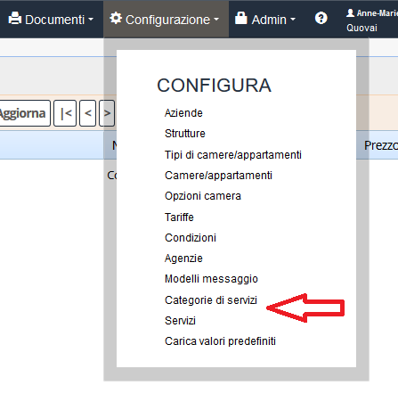
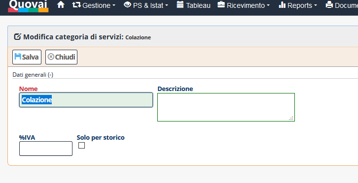
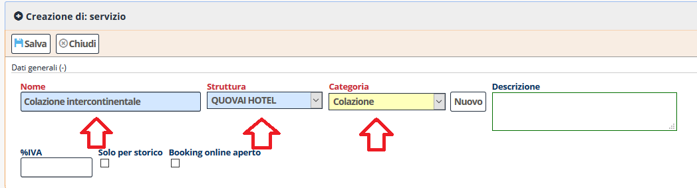
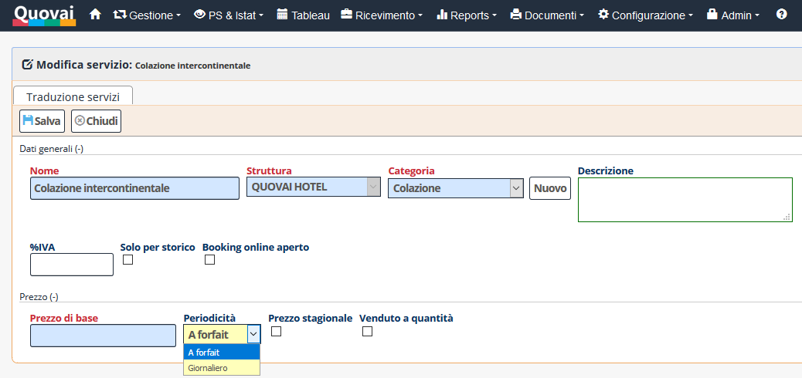
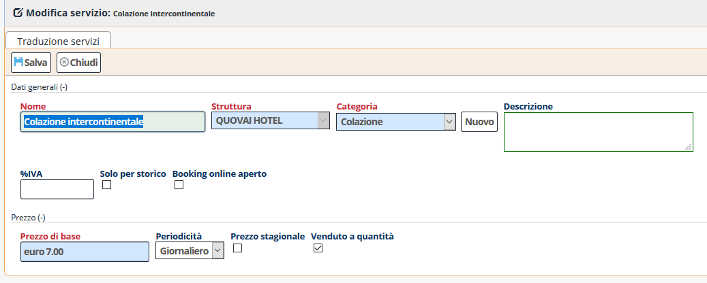
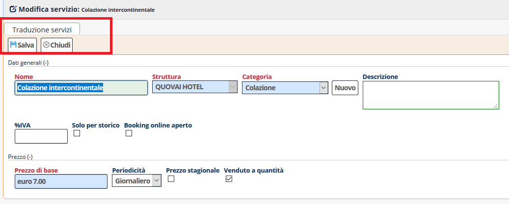
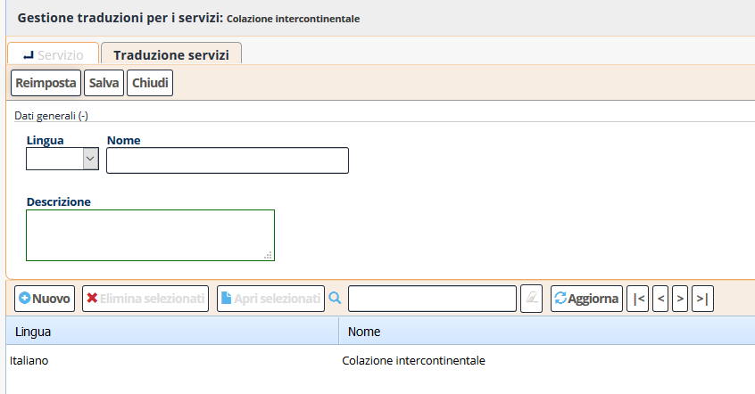
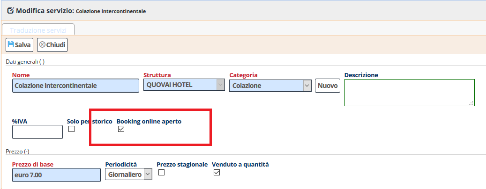

[Indice](index.md) / [Quovai PMS](quovai-pms-it.md) / Come rendere prenotabili i servizi extra

# Come rendere prenotabili i servizi extra

Per rendere prenotabili sul sistema di booking online i servizi occorre prima abilitare la funzionalità per la propria struttura. Per far questo occorre entrare nella sezione  **Configurazione** e cliccare su **Strutture** 

All'apertura della scheda selezionando il checkbox **Prenotazioni servizi** viene attivata la funzionalità.

Cliccare su **Salva** per  e poi **Chiudi** per tornare alla lista delle strutture. 

Ora è necessario definire i servizi che possono essere prenotati. Per fare questo si definisce  prima (per chiarezza, ma questo passo non è obbligatorio) una categoria di servizi da dedicare alla prenotazione online. Cliccare quindi su **Configurazione** e  poi su **Categorie di servizi**

Aggiungere, per esempio, la categoria "colazione":

Cliccare su **Salva** per  e poi **Chiudi** per tornare alla lista delle categorie di servizi. 

Occorre creare ora un servizio, cioè un effettivo "extra" prenotabile online. Per far questo sempre dal menu **Configurazione**, cliccare su **Servizi**:

Inserire la descrizione di un servizio, per esempio, "colazione continentale" e poi scegliere la struttura e la categoria di servizio (usare per esempio quella appena creata):

Cliccando su **Salva** viene mostrato il dettaglio del **Prezzo** in basso:  

Per il nostro esempio, inserire 

 - **Prezzo di base**: 7 euro.
 - **Periodicità**: a scelta fra giornaliero (significa che viene moltiplicata per tutta la durata del soggiorno) o a forfait. Scegliere giornaliero per il nostro esempio.
 - **Venduto a quantità**: indica che possono essere venduti più elementi dello stesso servizio (per esempio, potrebbe essere l'accesso a un centro benessere o un noleggio biciclette).
 

cliccare
Premeremo poi su **Salva**. Il servizio è stato creato, ma al momento non ci sono traduzioni.

Passiamo quindi alla **Traduzione servizi**: 

Il sistema di default crea una traduzione per la lingua corrente. Nella traduzione è possibile specificare il nome del servizio e la descrizione in breve. Scegliere le lingue addizionali e aggiungere i testi corrispondenti: 

  
Cliccare su **Salva** e poi tornare alla pagina principale dei servizi. 

Il servizio è ora stato creato ma non è ancora prenotabile online. Selezionere **booking online aperto** e cliccare su **Salva**.

Per mostrare tutta l'operazione in tempo reale, abbiamo creato un video su YouTube:

[https://www.youtube.com/watch?v=WoaVH7Ps69o&feature=youtu.be](https://www.youtube.com/watch?v=WoaVH7Ps69o&feature=youtu.be)  

